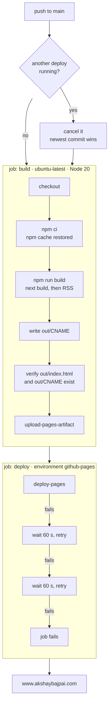
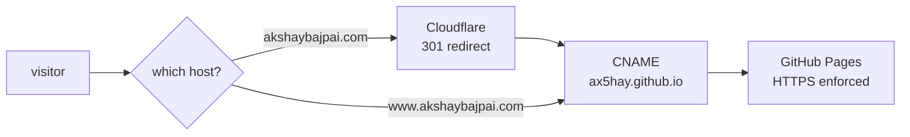

<div align="center">

# Deployment

**How the set gets from a commit to [www.akshaybajpai.com](https://www.akshaybajpai.com).**

Static files, built by GitHub Actions, served by GitHub Pages, for free.

[](https://github.com/ax5hay/akshaybajpai.com/actions/workflows/deploy.yml)


</div>

```
┌────────────────────────────────────────────────────────────────────────────┐
│  DEPLOYMENT RUNBOOK                            SHEET   C-701    REV    B   │
│  Drawing set · Akshay Bajpai                   HOST    GitHub Pages        │
│  Source of truth: .github/workflows/deploy.yml                             │
└────────────────────────────────────────────────────────────────────────────┘
```

## At a glance

| | |
|:--|:--|
| **Live URL** | https://www.akshaybajpai.com |
| **Host** | GitHub Pages, deployed from GitHub Actions (not from a branch) |
| **Trigger** | Any push to `main`, which in practice means merging a pull request |
| **Time to live** | About one minute; the last six deploys took 55 to 90 seconds |
| **What is deployed** | The `out/` directory from `npm run build`: static HTML, CSS, JS, fonts |
| **Server-side code** | None. No functions, no database, no environment variables, no secrets |
| **Cost** | Nothing for hosting, CI or the certificate. The domain registration is the only bill |
| **Third-party runtime service** | Formspree, for the contact form |

## Contents

1. [How a deploy works](#1--how-a-deploy-works)
2. [What gets built](#2--what-gets-built)
3. [Domain, DNS and HTTPS](#3--domain-dns-and-https)
4. [Day to day](#4--day-to-day)
5. [Verifying a deploy](#5--verifying-a-deploy)
6. [Rolling back](#6--rolling-back)
7. [One-time setup](#7--one-time-setup)
8. [Troubleshooting](#8--troubleshooting)
9. [Known limits](#9--known-limits)

---

## 1 · How a deploy works



The workflow is [`.github/workflows/deploy.yml`](.github/workflows/deploy.yml). Two jobs:

| Job | Step | What it does | Why |
|:----|:-----|:-------------|:----|
| `build` | Checkout | `actions/checkout@v4` | |
| | Setup Node | Node 20 with the npm cache | Keeps installs to a few seconds |
| | Install | `npm ci` | Exact versions from `package-lock.json` |
| | Build | `npm run build` | `next build` exports to `out/`, then `scripts/generate-rss.mjs` writes `out/rss.xml` |
| | Preserve CNAME | Writes `www.akshaybajpai.com` to `out/CNAME` | Pages reads the custom domain from the artifact. Without this file a deploy would drop the domain |
| | Verify artifact | Fails unless `out/index.html` and `out/CNAME` exist | Stops an empty or domainless site from going live |
| | Upload | `actions/upload-pages-artifact@v4` | Hands `out/` to the deploy job |
| `deploy` | Deploy | `actions/deploy-pages@v4`, up to three attempts 60 s apart | Pages deploys occasionally fail transiently; retrying is cheaper than re-running the build |

**Permissions.** The workflow asks for `contents: read`, `pages: write` and
`id-token: write`, and nothing else. The deploy job runs in the `github-pages` environment,
which only accepts deployments from `main`.

**Concurrency.** Deploys share one group with `cancel-in-progress: true`. If two merges land
close together, the older run is cancelled and only the newest commit is deployed.

**What CI checks.** `next build` type-checks the project, so a type error fails the
deploy. There is no separate test step, and nothing runs on pull requests: a branch is
only built when it reaches `main`.

---

## 2 · What gets built

`next.config.ts` sets `output: 'export'`, so the build produces plain files and no server.

```
out/
├── index.html                  # G-000, the key plan
├── about/ · architecture/ · research/ · contact/
├── work/ · blog/ · essays/     # each: index.html + one folder per sheet
│   └── <slug>/
│       ├── index.html          # the sheet
│       └── index.txt           # its payload, fetched on client navigation
├── set/index.html              # the whole set as one document, for print
├── 404.html                    # X-999, Sheet Not Issued
├── _next/static/               # hashed JS, CSS and self-hosted fonts
├── sitemap.xml                 # from app/sitemap.ts
├── robots.txt                  # from app/robots.ts
├── rss.xml                     # from scripts/generate-rss.mjs (blog only)
├── og.jpg · logo.png · favicon.svg · site.webmanifest
└── CNAME                       # written by the workflow
```

| Setting | Value | Consequence |
|:--------|:------|:------------|
| `output` | `'export'` | Static files only; nothing can run on a server |
| `trailingSlash` | `true` | Every route is a folder with an `index.html`, which is how Pages serves clean URLs |
| `images.unoptimized` | `true` | No image optimisation service exists on a static host |

The export is 33 HTML pages and about 7.5 MB in total, most of it the per-sheet payloads and
the fonts.

**Fonts are self-hosted.** `next/font` downloads Instrument Serif and IBM Plex at build
time and ships them from `_next/static/media/`. The live site makes no request to Google.

---

## 3 · Domain, DNS and HTTPS



| Record | Observed value | Purpose |
|:-------|:---------------|:--------|
| Nameservers | `*.ns.cloudflare.com` | DNS is managed in Cloudflare |
| `www` `CNAME` | `ax5hay.github.io` | Points the site at GitHub Pages. This is the canonical host |
| Apex `akshaybajpai.com` | Cloudflare addresses, answering `301 → https://www.akshaybajpai.com/` | The bare domain redirects to `www` at Cloudflare and never reaches Pages |
| `http://` on either host | `301 → https://www.akshaybajpai.com/` | HTTPS is enforced in the Pages settings |

**The custom domain is declared in two places, and both matter:**

- `CNAME` in the repository root, containing `www.akshaybajpai.com`.
- `out/CNAME`, written by the workflow on every deploy. This is the one Pages reads.

**The certificate** is issued and renewed by GitHub for `www.akshaybajpai.com`. Nothing
needs doing; if it ever lapses, re-saving the custom domain in the Pages settings requests
a new one.

> [!NOTE]
> The apex redirect lives in the Cloudflare account, not in this repository. The values
> above are what the live domain returns; the exact Cloudflare rule that produces them was
> not read from the dashboard.

---

## 4 · Day to day

### Publishing a change

```bash
git checkout -b my-change
# edit
npm run build            # the same build CI runs; catches type errors before the PR
git commit -am "…" && git push -u origin my-change
gh pr create --fill
gh pr merge --merge      # this is the deploy
```

### Publishing writing

Add a Markdown file under `content/blog/`, `content/essays/` or `content/work/` and merge
it. The sheet is numbered, and added to the key plan, the index, the sitemap and (for blog
posts) the RSS feed, with no other change. See
[Content pipeline](README.md#s-202--content-pipeline).

### Watching a deploy

```bash
gh run list --workflow deploy.yml --limit 5
gh run watch                       # follow the newest run
```

Or open the [Actions tab](https://github.com/ax5hay/akshaybajpai.com/actions/workflows/deploy.yml).

---

## 5 · Verifying a deploy

```bash
# The run for your commit succeeded
gh run list --workflow deploy.yml --limit 1

# The site answers, over HTTPS, from GitHub
curl -sI https://www.akshaybajpai.com/ | grep -iE '^HTTP|^server|^last-modified'

# The apex and plain HTTP both redirect to the canonical host
curl -sI https://akshaybajpai.com/      | grep -iE '^HTTP|^location'
curl -sI http://www.akshaybajpai.com/   | grep -iE '^HTTP|^location'

# The supporting files are there
for p in sitemap.xml robots.txt rss.xml og.jpg; do
  curl -s -o /dev/null -w "%{http_code}  $p\n" "https://www.akshaybajpai.com/$p"
done

# An unknown path returns the X-999 sheet with a real 404 status
curl -s -o /dev/null -w "%{http_code}\n" https://www.akshaybajpai.com/no-such-sheet/
```

Then look at it:

- [ ] Open the site in a **new tab or a private window**, so the cover sheet plays.
- [ ] The cover counts up, offers **Skip intro · Enter the set**, and lifts.
- [ ] Click a sheet on the key plan; it grows into its page.
- [ ] Press <kbd>D</kbd> twice; both other modes render.
- [ ] Open one case study and operate its schematic.
- [ ] Press <kbd>/</kbd>; the index opens with a preview beside the list.
- [ ] On a phone, or a narrow window: the pile scrolls, the dock is at the foot, and on an
      article the section strip rides under the rail.
- [ ] Read two sheets for a few seconds each, then return to the key plan: a traverse joins them.
- [ ] Press **▶ Tour** on the key plan; it visits each sheet and stops on <kbd>Esc</kbd>.
- [ ] Open `/set/` and print to PDF; every sheet starts a new page.
- [ ] Follow a link to a path that does not exist; the unissued sheet offers the nearest ones.

> [!TIP]
> If the site looks unchanged after a successful run, it is almost always the cache. Pages
> serves every file with `cache-control: max-age=600`, so a browser or the CDN may hold the
> previous version for up to ten minutes. A hard reload settles it.

---

## 6 · Rolling back

There is no deploy history to click through; the live site is always the newest successful
build of `main`. To go back, put `main` back.

**Preferred: revert the merge.** This keeps history honest and deploys in a minute.

```bash
git checkout main && git pull
git log --oneline -5                 # find the merge commit to undo
git revert -m 1 <merge-sha>
git push                             # triggers a deploy of the reverted tree
```

**Alternative: re-run an older deploy.** Re-running a past workflow run rebuilds and
redeploys the commit it ran on, without touching `main`.

```bash
gh run list --workflow deploy.yml --limit 10
gh run rerun <run-id>
```

> [!WARNING]
> After a re-run the live site no longer matches `main`, and the next push to `main` will
> replace it again. Use this to buy time, then land a proper revert.

---

## 7 · One-time setup

Already done for this repository. Recorded for a fork, or for rebuilding from nothing.

1. **Pages source.** Settings → Pages → Build and deployment → Source: **GitHub Actions**.
2. **Custom domain.** Settings → Pages → Custom domain: `www.akshaybajpai.com`, and tick
   **Enforce HTTPS** once the certificate has been issued.
3. **`CNAME` file.** Keep `CNAME` in the repository root, and keep the workflow step that
   writes `out/CNAME`.
4. **DNS.** A `CNAME` record for `www` pointing at `<user>.github.io`. Redirect the apex to
   `www` at the DNS provider, or point it at GitHub's Pages addresses.
5. **Environment.** The `github-pages` environment is created by the first deploy. Its
   branch policy should allow `main` only.

No secrets, tokens or environment variables are required. The workflow authenticates with
the `id-token` permission GitHub grants it.

<details>
<summary><b>Changing the domain</b></summary>

<br/>

Four places name it, and all four have to change together:

| Where | What |
|:------|:-----|
| `CNAME` | The domain |
| `.github/workflows/deploy.yml` | The `echo "…" > out/CNAME` step |
| `lib/constants.ts` | `SITE_URL`, used for canonical URLs, the sitemap and share cards |
| `scripts/generate-rss.mjs` | `SITE`, used for feed links |

Then update the custom domain in the Pages settings and the DNS record.

</details>

---

## 8 · Troubleshooting

| Symptom | Likely cause | Fix |
|:--------|:-------------|:----|
| **Build fails with a type error in a file you did not touch** | A stray, untracked `.ts` or `.tsx` file locally. `tsc` checks every file in the tree, tracked or not | Delete or fix the stray file. CI is unaffected, because it only has tracked files |
| **Build fails locally at the export step** | Something is holding `out/` open, usually a preview server | Stop the server, build, start it again |
| **Site loads unstyled just after a deploy** (plain text, no layout) | A CDN edge served the new HTML but answered 404 for the newly named CSS, and cached that 404 for ten minutes | The page now retries a failed stylesheet under a fresh URL by itself (`ModeScript`). If it is ever seen again, a reload a minute later clears it |
| **Run succeeded, site unchanged** | `max-age=600` caching | Hard reload, or wait ten minutes |
| **Site serves on `ax5hay.github.io` but not the custom domain** | `out/CNAME` was missing from the artifact | Check the *Preserve CNAME* step ran; re-save the custom domain in Pages settings |
| **Certificate warning** | Custom domain was removed and re-added, and the new certificate is still being issued | Wait; then re-tick **Enforce HTTPS** |
| **Deploy job fails three times** | A GitHub Pages incident | Check [githubstatus.com](https://www.githubstatus.com/), then `gh run rerun <run-id> --failed` |
| **A new post is missing** | `draft: true` in its frontmatter, or a missing `title`, `description` or `pubDate` | Fix the frontmatter and merge |
| **A sheet's number changed** | Detail sheets are numbered by publication date, so adding or re-dating one renumbers the series | Expected. Link to sheets by URL, not by number |
| **Contact form fails** | Formspree is unreachable or its endpoint changed | The form already tells the visitor to email instead. The endpoint is in `components/plate/CorrespondenceForm.tsx` |
| **A hint note never appears** | Each is shown once per browser, ever, and "No more notes" turns them off | Clear `plate.notes` and `plate.notes.off` from the site's local storage |
| **The cover sheet does not appear** | It plays once per tab session, and never under reduced motion | Open a new tab or a private window |

---

## 9 · Known limits

These come with the host, and are accepted trade-offs for a free static site.

| Limit | Effect |
|:------|:-------|
| **One cache policy for every file** | Pages sends `max-age=600` for everything, including content-hashed assets that could be cached forever. Returning visitors revalidate after ten minutes |
| **No custom headers** | No Content-Security-Policy, HSTS preload or custom caching can be set from this repository |
| **No server** | Anything dynamic has to be a third-party service called from the browser, as the contact form is |
| **Deploys are not atomic across the CDN** | For a short while after a deploy, an edge can hold new HTML and old assets. Hashed file names change every build, so the mismatch shows as missing CSS; the page retries those requests |
| **No preview deployments** | A pull request is not built anywhere until it merges. Build locally before merging |
| **One site per repository** | There is no staging copy; `main` is production |
| **Compression** | Pages serves gzip. Brotli is not offered |

---

<div align="center">

<sub>Back to the <a href="README.md">README</a> · Workflow: <a href=".github/workflows/deploy.yml"><code>deploy.yml</code></a></sub>

</div>
