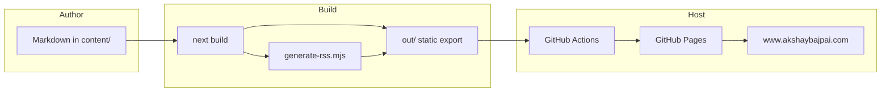
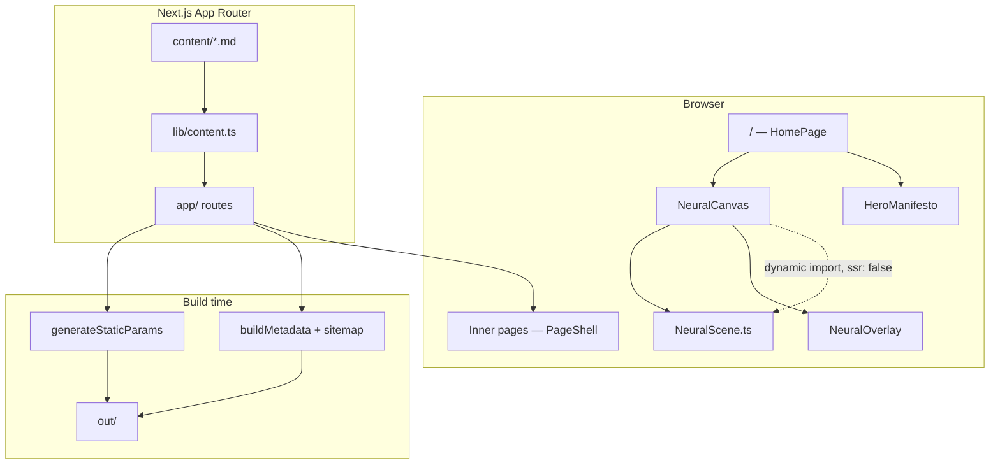
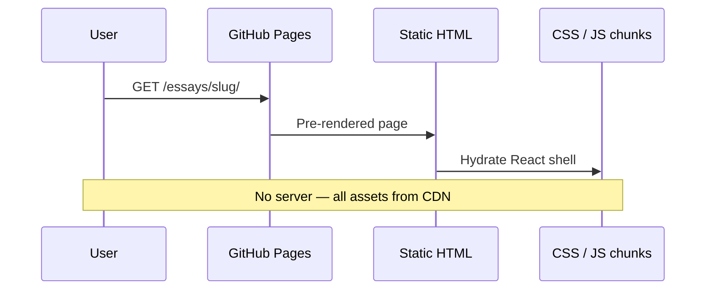
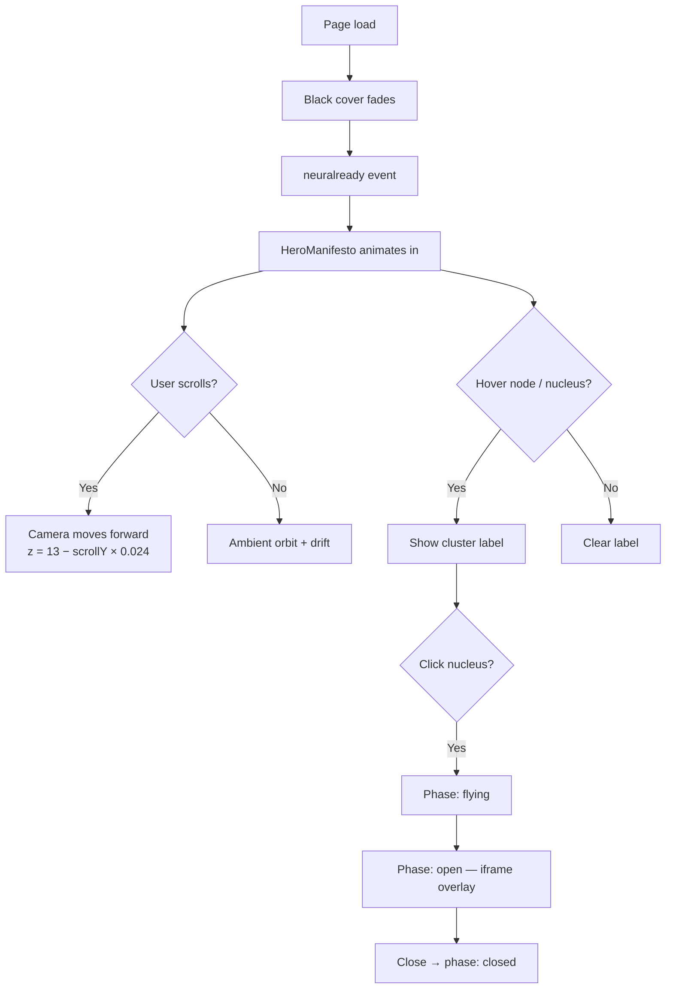
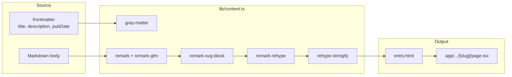
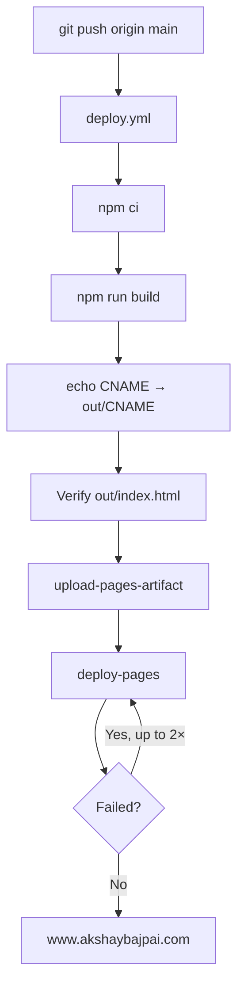
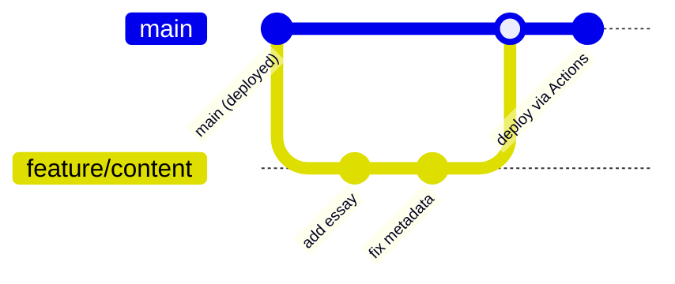

# The Architecture of Intelligence

[](https://github.com/ax5hay/akshaybajpai.com/actions/workflows/deploy.yml)
[](https://www.akshaybajpai.com)
[](https://nextjs.org/)
[](https://www.typescriptlang.org/)
[](https://nodejs.org/)

**Live:** [www.akshaybajpai.com](https://www.akshaybajpai.com)

Personal site and **living neural map** — a scroll-driven Three.js constellation that doubles as spatial navigation into essays, work, and writing. Built with Next.js 15 static export and deployed to GitHub Pages at zero cost.

---

## Table of contents

- [Overview](#overview)
- [Features](#features)
- [Architecture](#architecture)
- [Neural map](#neural-map)
- [Content pipeline](#content-pipeline)
- [Tech stack](#tech-stack)
- [Quick start](#quick-start)
- [Scripts](#scripts)
- [Project structure](#project-structure)
- [Routes](#routes)
- [Authoring content](#authoring-content)
- [Deployment](#deployment)
- [Git workflow](#git-workflow)
- [License](#license)

---

## Overview

This repository is a **static-first** personal site for Akshay Bajpai. The homepage is not a traditional landing page — it is an explorable 3D neural constellation. Content lives in Markdown collections; pages are pre-rendered at build time and served from `out/` on GitHub Pages.



| Property | Value |
|----------|-------|
| **Domain** | `www.akshaybajpai.com` |
| **Framework** | Next.js 15 App Router |
| **Output** | Static HTML (`output: 'export'`) |
| **3D engine** | Three.js (client-only, lazy-loaded) |
| **Content** | Markdown + gray-matter + remark |
| **Hosting** | GitHub Pages via Actions |
| **Node** | ≥ 18 (CI uses 20) |

---

## Features

| Area | What it does |
|------|----------------|
| **Neural map** | Five cluster nuclei (Essays, About, Work, Blog, Contact) with orbiting nodes and curved connection lines |
| **Scroll camera** | Scrolling pulls the camera into the network; a 150vh spacer drives depth without extra UI |
| **Overlay navigation** | Click a cluster → camera flies in → section loads in a full-screen iframe overlay |
| **Raw mode** | Hold **Shift** and scroll on the canvas to swap human labels for technical snippets |
| **Content collections** | `blog`, `essays`, `work` — each with frontmatter, SSG routes, and RSS for blog |
| **SEO** | Per-page metadata, JSON-LD, sitemap, robots.txt |
| **Accessibility** | `prefers-reduced-motion` disables the 3D scene; focus rings and semantic landmarks throughout |

---

## Architecture

High-level system design: build-time content compilation, client-side 3D on the homepage only, static export for hosting.



### Request flow (inner pages)



---

## Neural map

The homepage stacks three layers: fixed WebGL canvas, hero copy, and a scroll spacer.



### Cluster map

| Index | Label | Route | Raw-mode snippet |
|-------|-------|-------|------------------|
| 0 | Essays | `/essays/` | `model = load(embedding); index.add(vectors);` |
| 1 | About | `/about/` | `constraints → invariants → feedback loops` |
| 2 | Work | `/work/` | `latency_p99 < 50ms; throughput 10k/s` |
| 3 | Blog | `/blog/` | `auth, billing, webhooks, docs` |
| 4 | Contact | `/contact/` | `scroll-linked camera; instanced mesh` |

### Rendering model

The scene is tuned for performance — no per-frame geometry rebuilds:

```
InstancedMesh (80 thought nodes)
        +
LineSegments (curved edges, in-place buffer updates)
        +
5 nucleus meshes (click targets)
        +
Raycaster (hover + click)
```

Key constants live in `components/neural/NeuralScene.ts`:

```ts
const CLUSTER_COUNT = 5;
const NODES_PER_CLUSTER = 16;
const MAX_EDGES = 900;
const CURVE_SAMPLES = 6;
```

---

## Content pipeline

Markdown files are read at **build time** only — there is no runtime CMS.



### Collections

| Collection | Path | Frontmatter | Notes |
|------------|------|-------------|-------|
| `blog` | `content/blog/` | `title`, `description`, `pubDate`, `draft?` | Included in RSS |
| `essays` | `content/essays/` | same | Long-form writing |
| `work` | `content/work/` | + `client?`, `stack?`, `metrics?` | Case studies |

Example frontmatter:

```yaml
---
title: "AI Infrastructure Philosophy"
description: "Why the best AI systems treat infrastructure as a first-class product."
pubDate: 2025-01-15
draft: false
---
```

---

## Tech stack

| Layer | Technology | Role |
|-------|------------|------|
| Framework | [Next.js 15](https://nextjs.org/) | App Router, SSG, static export |
| UI | React 19 | Components, client islands |
| Language | TypeScript 5.7 | Types across app and lib |
| 3D | [Three.js](https://threejs.org/) | Neural constellation (homepage) |
| Markdown | remark, remark-gfm, gray-matter | Parse and render content |
| Fonts | Instrument Serif, IBM Plex Sans/Mono | via `next/font` |
| CI/CD | GitHub Actions | Build + deploy-pages |
| Hosting | GitHub Pages | Serves `out/` |

---

## Quick start

### Prerequisites

- Node.js **≥ 18** (20 recommended)
- npm **≥ 9**

### Install and run

```bash
git clone https://github.com/ax5hay/akshaybajpai.com.git
cd akshaybajpai.com
npm install
npm run dev
```

Open [http://localhost:3000](http://localhost:3000).

### Production build

```bash
npm run build
```

Output directory: `out/`

Preview the static export locally:

```bash
npx serve out
```

---

## Scripts

| Command | Description |
|---------|-------------|
| `npm run dev` | Start Next.js dev server (hot reload) |
| `npm run build` | Static export to `out/` + generate `out/rss.xml` |
| `npm run start` | Serve production build (Node server — mainly for non-export use) |
| `npm run lint` | ESLint via Next.js |
| `npm run typecheck` | `tsc --noEmit` |

Build pipeline:

```bash
next build && node scripts/generate-rss.mjs
```

---

## Project structure

```
akshaybajpai.com/
├── app/                          # Next.js App Router
│   ├── layout.tsx                # Root layout, fonts, JSON-LD
│   ├── page.tsx                  # Homepage → HomePage
│   ├── globals.css               # Design tokens + global styles
│   ├── blog/                     # Blog index + [slug] routes
│   ├── essays/                   # Essays index + [slug] routes
│   ├── work/                     # Work index + [slug] routes
│   ├── about/                    # Static pages
│   ├── contact/
│   ├── research/
│   ├── architecture/
│   ├── sitemap.ts
│   └── not-found.tsx
│
├── components/
│   ├── HomePage.tsx              # Neural map shell (homepage)
│   ├── HeroManifesto.tsx         # Hero copy + scroll hints
│   ├── PageShell.tsx             # Header / main / footer wrapper
│   ├── Header.tsx, Footer.tsx
│   ├── neural/
│   │   ├── NeuralScene.ts        # Three.js scene logic
│   │   ├── NeuralCanvas.tsx      # React mount + hover UI
│   │   └── NeuralOverlay.tsx     # Iframe overlay on cluster click
│   └── experience/               # Unused scroll experiment (not on homepage)
│
├── content/                      # Markdown source of truth
│   ├── blog/
│   ├── essays/
│   └── work/
│
├── lib/
│   ├── content.ts                # Collection loader + remark pipeline
│   ├── metadata.ts               # SEO helpers
│   ├── constants.ts              # Nav links, cluster config, social
│   └── remark-svg-block.ts       # SVG passthrough in markdown
│
├── public/                       # Static assets (copied to out/)
├── scripts/
│   └── generate-rss.mjs          # Post-build RSS for blog
│
├── .github/workflows/
│   └── deploy.yml                # GitHub Pages CI/CD
│
├── next.config.ts                # output: 'export', trailingSlash
├── CNAME                         # www.akshaybajpai.com
└── DEPLOYMENT.md                 # Deploy runbook
```

> **Note:** A legacy `src/` Astro tree remains in the repo from the original migration. The active application is `app/`, `components/`, and `content/` — not `src/`.

---

## Routes

| Path | Type | Description |
|------|------|-------------|
| `/` | Client | Neural map + hero manifesto |
| `/blog/` | SSG | Blog index |
| `/blog/[slug]/` | SSG | Blog article |
| `/essays/` | SSG | Essays index |
| `/essays/[slug]/` | SSG | Essay |
| `/work/` | SSG | Work index |
| `/work/[slug]/` | SSG | Case study |
| `/about/` | Static | About |
| `/contact/` | Static | Contact form UI |
| `/research/` | Static | Research |
| `/architecture/` | Static | Architecture notes |
| `/sitemap.xml` | Generated | Sitemap |
| `/rss.xml` | Post-build | Blog RSS (`scripts/generate-rss.mjs`) |
| `/robots.txt` | Static | Crawler rules |

All routes use `trailingSlash: true` in `next.config.ts`.

---

## Authoring content

1. Add a `.md` file under `content/blog/`, `content/essays/`, or `content/work/`.
2. Include required frontmatter (`title`, `description`, `pubDate`).
3. Set `draft: true` to exclude from production builds.
4. Run `npm run build` — Next.js picks up new slugs via `generateStaticParams`.

Work entries can include optional fields:

```yaml
---
title: "Healthcare AI Pipeline"
description: "End-to-end ML pipeline for clinical decision support."
pubDate: 2024-11-01
client: "Confidential"
stack: ["Python", "PyTorch", "Kubernetes"]
metrics: ["97% accuracy", "p99 < 120ms"]
---
```

---

## Deployment

Push to `main` triggers the deploy workflow. No manual steps required after initial GitHub Pages setup.



### One-time GitHub setup

1. **Settings → Pages → Build and deployment:** Source = **GitHub Actions**
2. Ensure repo root `CNAME` contains `www.akshaybajpai.com`
3. DNS: CNAME record `www` → `<user>.github.io`

See [DEPLOYMENT.md](./DEPLOYMENT.md) for the full runbook.

### Build artifact layout

```
out/
├── index.html
├── _next/static/...
├── blog/
├── essays/
├── work/
├── rss.xml          # generated post-build
├── sitemap.xml
├── CNAME
└── ...
```

---

## Git workflow

Recommended flow for changes:



| Step | Command |
|------|---------|
| Clone | `git clone https://github.com/ax5hay/akshaybajpai.com.git` |
| Branch | `git checkout -b feature/your-change` |
| Verify | `npm run typecheck && npm run build` |
| Commit | Use imperative mood: `Add essay on trust`, `Fix neural hover label` |
| Push | `git push origin feature/your-change` → open PR → merge to `main` |
| Deploy | Automatic on merge to `main` |

### What not to commit

| Path | Reason |
|------|--------|
| `node_modules/` | Installed via `npm ci` |
| `.next/` | Build cache |
| `out/` | Generated at CI — not tracked |
| `.env*` | Secrets (none required for this static site) |

### Conventional commit examples

```text
feat: add blog post on RAG evaluation
fix: neural overlay close on escape key
docs: update README deployment diagram
chore: bump three to 0.170
```

---

## Configuration reference

`next.config.ts`:

```ts
const nextConfig = {
  output: 'export',
  trailingSlash: true,
  images: { unoptimized: true },
  compress: true,
  poweredByHeader: false,
  reactStrictMode: true,
};
```

---

## License

Content and design © Akshay Bajpai. All rights reserved.
