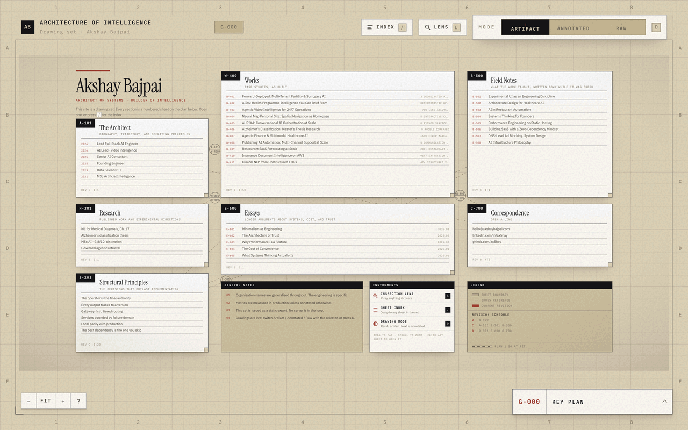
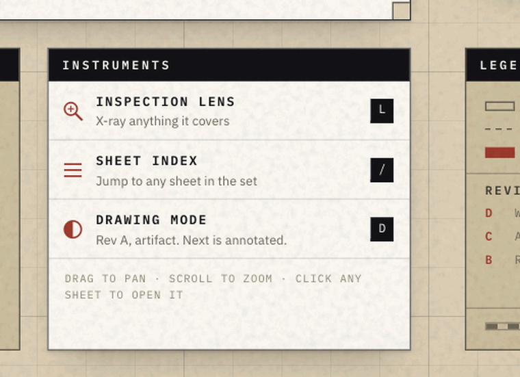
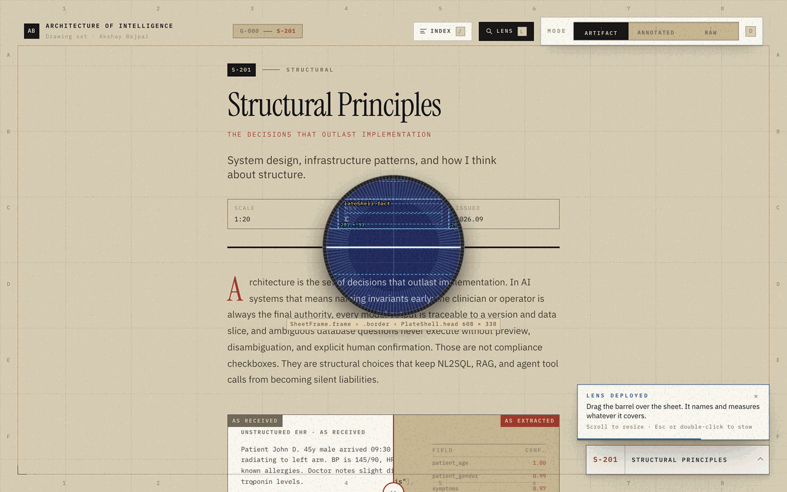
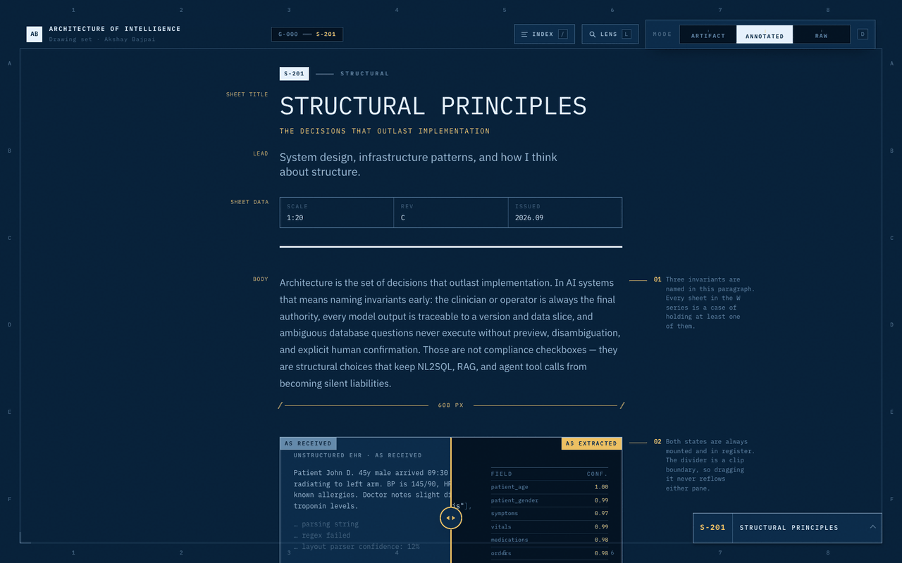
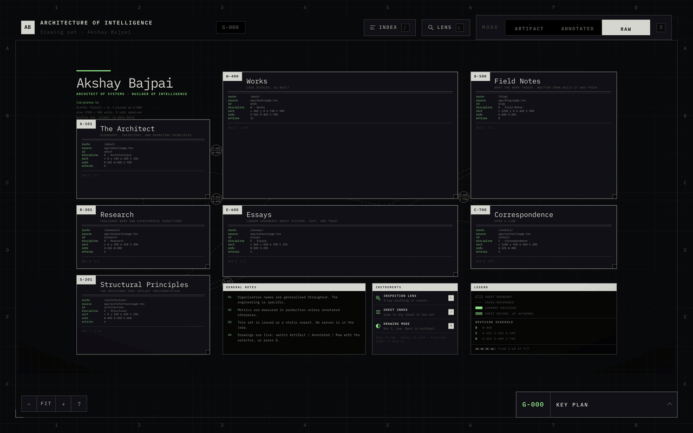
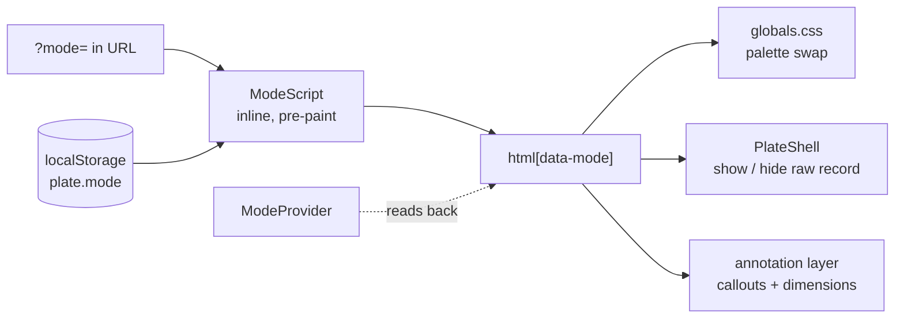
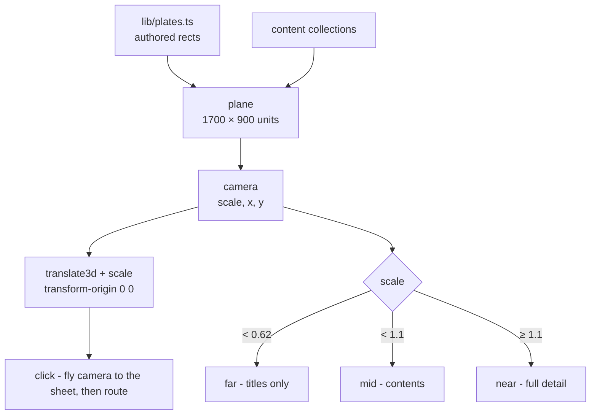
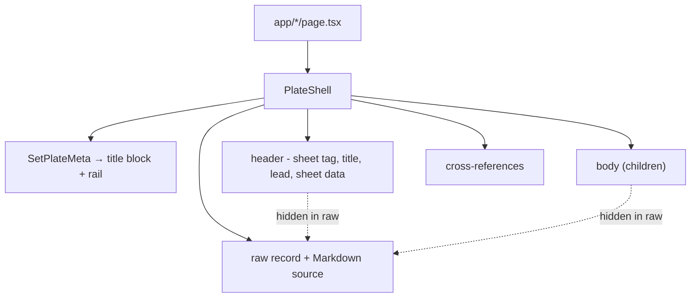
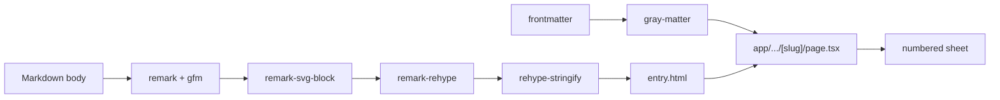
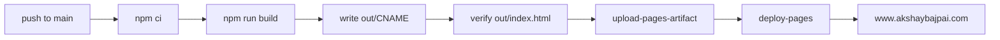

<div align="center">

# The Architecture of Intelligence

**A personal site issued as a drawing set.**

Every route is a numbered sheet. The homepage is the key plan those sheets sit on.<br/>
It is an instrument, not a brochure: re-issue the whole set in three states,<br/>
or put an x-ray lens over any part of it and read what it is made of.

<br/>

[](https://www.akshaybajpai.com)
[](https://github.com/ax5hay/akshaybajpai.com/actions/workflows/deploy.yml)


<br/>

**Open a mode directly ·**
[Artifact](https://www.akshaybajpai.com/architecture/?mode=artifact) ·
[Annotated](https://www.akshaybajpai.com/architecture/?mode=annotated) ·
[Raw](https://www.akshaybajpai.com/architecture/?mode=raw)

<br/>



<sub><b>G-000 · Key plan.</b> The homepage is a pannable, zoomable general arrangement. Every sheet is<br/>
drawn in place, joined by leaders with split-circle cross-reference bubbles. Hovering a sheet lights<br/>
the ones it references and sends the rest back, so the plan reads out its own wiring.</sub>

</div>

---

```
┌──────────────────────────────────────────────────────────────────────┐
│  ARCHITECTURE OF INTELLIGENCE              SHEET   G-000   REV    D  │
│  Drawing set · Akshay Bajpai               SCALE   1:50    ISSUED    │
│  Next.js 15 · static export · GitHub Pages                 2026.09   │
└──────────────────────────────────────────────────────────────────────┘
```

The previous version of this site had a Three.js neural map on the homepage and
conventional pages everywhere else, joined by an iframe overlay. It read as two
products stapled together. This version commits to **one metaphor, end to end**.

---

## Drawing index

| Sheet | Section | What it covers |
|:------|:--------|:---------------|
| [`G-001`](#the-idea) | **The idea** | Why a drawing set, and what that buys |
| [`G-002`](#the-instruments) | **The instruments** | The lens, the index, the mode switch |
| [`G-003`](#drawing-modes) | **Drawing modes** | The three states and why they are CSS-only |
| [`G-004`](#sheet-registry) | **Sheet registry** | Numbering, disciplines, routes |
| [`S-001`](#key-plan) | **Key plan** | Camera, level of detail, leader geometry |
| [`S-002`](#how-a-plate-is-composed) | **Plate composition** | `PlateShell` and the component kit |
| [`S-003`](#interaction-model) | **Interaction** | Keyboard, motion, accessibility |
| [`W-001`](#content-pipeline) | **Content pipeline** | Markdown in, static sheets out |
| [`W-002`](#quick-start) | **Quick start** | Run it locally |
| [`W-003`](#project-structure) | **Project structure** | Where everything lives |
| [`C-001`](#deployment) | **Deployment** | Build, CI, and the live domain |

---

## The idea

The site is a drawing set, and the metaphor is load-bearing rather than decorative.

<table>
<tr><td width="33%">

### Sheets, not pages

Every route carries a number, a discipline, a scale, and a revision: `A-101 The
Architect`, `S-201 Structural Principles`, `W-402 AIDA`. The numbers *are* the
navigation.

</td><td width="33%">

### A key plan, not a landing page

The homepage is `G-000`, a general arrangement showing where every sheet sits.
Clicking one flies the camera to it before the route changes, so the zoom is
continuous rather than a cut.

</td><td width="33%">

### Chrome that never leaves

The drawing frame, zone rulers, trim marks, rail, and title block persist across
navigation. Changing route reads as a new sheet laid on the same board.

</td></tr>
</table>

Cross-references are real links, and the title block always reports the sheet you
are actually on, including detail sheets, which carry their own number rather
than their section's.

---

## The instruments

A set that can be operated is worth nothing if nobody works out that it can be.
So the tools are **printed on the first sheet you land on**, named, with their
keys, as a block of plan furniture beside the general notes. Nothing here has to
be discovered by clicking around and getting lucky.

<table>
<tr>
<td width="46%" valign="top">



</td>
<td width="54%" valign="top">

**Drawn, not hidden.** The tray is a real part of the drawing, in the same
reversed-header style as the legend and the general notes. Each row is a button
that does the thing it describes, and each prints the keyboard shortcut for it.

On a first visit the tray pulses three times and a toast says what the set can
do. Both are `localStorage`-gated and never appear again, and both stop the
moment anything is operated.

On narrow screens the tray moves to the very top, above the name.

</td>
</tr>
</table>

### The inspection lens



<sub><b>The lens is an x-ray, not a magnifier.</b> It outlines, names, and measures every element it
covers, and the readout under the barrel prints the containment chain at the crosshair.</sub>

Optically it is a `backdrop-filter: invert()`, so the page underneath is
recomposited rather than re-rendered. The technical layer is drawn once across
the whole viewport and revealed through a moving `clip-path` circle, which makes
a drag cost one style write instead of a re-measure of the page.

- **Drag** the barrel, or nudge it with the arrow keys.
- **Scroll** over it to change the diameter.
- <kbd>Esc</kbd> or double-click to stow it.

> [!WARNING]
> The barrel shadow must be `box-shadow`, never `filter: drop-shadow()`. Any
> `filter` on an ancestor makes it a **backdrop root**, which leaves the optic
> with nothing behind it to invert and turns the lens into an empty circle.

### The rest

| Instrument | Key | What it does |
|:-----------|:----|:-------------|
| Inspection lens | <kbd>L</kbd> | Outlines, names, and measures whatever it covers |
| Sheet index | <kbd>/</kbd> | Fuzzy-ranked search across the whole set |
| Drawing mode | <kbd>D</kbd> | Cycles artifact, annotated, raw |
| Comparison sliders | <kbd>←</kbd> <kbd>→</kbd> | Native range input, so keyboard and screen readers work unmodified |
| Key plan camera | drag, scroll | Pan and zoom, with level of detail tied to scale |

State for the lens and the index lives in `InstrumentProvider`, above the rail,
precisely so that any surface can offer them. The key plan is the surface that
takes it up.

---

## Drawing modes

The switch in the rail re-issues the set. This is the *dev-aligned* view of the
site, and it is a first-class state rather than a debug toggle.

**The three modes differ in what they say, not only in what colour they say it
in.** Each one adds or removes real content.

<table>
<tr>
<td width="50%" valign="top">



**`REV B` · Annotated**

Cyanotype, and the markup pen turns on. The key plan grows a chain dimension
across the composition, a revision cloud and triangle over the most recently
issued sheet, and a placement note on every sheet giving its grid reference,
its size in plan units, and its discipline. On a content sheet you get numbered
margin callouts on leader lines and dimension lines that measure themselves and
print the real rendered width.

</td>
<td width="50%" valign="top">



**`REV C` · Raw**

Presentation stripped. Each sheet on the plan replaces its contents table with
the record it was drawn from: route, source file, id, discipline, rect, refs,
entry count. The title block states the plan's own provenance. On a content
sheet the prose stays, every structural element is outlined and labelled with
its part name, and the verbatim Markdown is printed at the top.

</td>
</tr>
</table>

`REV A · Artifact` is the drawing as issued, and it is the default. Warm stock,
a board a full tone deeper than the sheets pinned to it, ink-weight sheet
boundaries, ruled contents tables, and reversed header bars on the furniture. No
markup at all, because an issued print does not carry any.

### Why it is CSS-only

Mode lives in a `data-mode` attribute on `<html>`. Every mode is a palette plus a
set of `display` rules. There are no mode branches in React.


```mermaid
flowchart LR
  QUERY["?mode= in URL"] --> SCRIPT
  STORE[("localStorage<br/>plate.mode")] --> SCRIPT["ModeScript<br/>inline, pre-paint"]
  SCRIPT --> HTML["html[data-mode]"]
  HTML --> CSS["globals.css<br/>palette swap"]
  HTML --> SHOW["PlateShell<br/>show / hide raw record"]
  HTML --> PEN["annotation layer<br/>callouts + dimensions"]
  PROVIDER["ModeProvider"] -. reads back .-> HTML
```

Three consequences worth keeping:

1. **All three modes ship as static markup.** No second render, no hydration
   flash. The server already emitted every mode's content, including the
   records and the markup layer, which is why they can differ in substance and
   still cost nothing to switch between.
2. **The mode resolves before first paint**, so the sheet never renders on paper
   and then re-inks to blueprint.
3. **Switching repaints but never reflows.** The measure is the same width in all
   three modes; annotations are drawn into margin the prose already left empty.

> [!WARNING]
> `ModeScript` is a server component and inlines the storage key **literally**.
> That key therefore lives in `lib/mode.ts`, which deliberately carries no
> `'use client'` directive. Importing it from `ModeProvider` instead yields a
> client-reference stub at build time and silently breaks persistence. The
> shipped script ends up reading `localStorage.getItem('function(){throw ...}')`.

---

## Sheet registry

[`lib/plates.ts`](lib/plates.ts) is the single source of truth. Numbers follow
drawing convention: a discipline letter, then a series where `x00` is the general
arrangement and `x01…` are its detail sheets.

| Sheet | Discipline | Route | Content |
|:------|:-----------|:------|:--------|
| `G-000` | General | `/` | Key plan |
| `A-101` | Architectural | `/about/` | The Architect |
| `S-201` | Structural | `/architecture/` | Structural Principles |
| `R-301` | Research | `/research/` | Research |
| `W-400` | Works | `/work/` | Works index |
| `W-401…` | Works | `/work/[slug]/` | Case studies |
| `B-500` | Field Notes | `/blog/` | Blog index |
| `B-501…` | Field Notes | `/blog/[slug]/` | Posts |
| `E-600` | Essays | `/essays/` | Essays index |
| `E-601…` | Essays | `/essays/[slug]/` | Essays |
| `C-700` | Correspondence | `/contact/` | Contact |
| `X-999` | Unissued | 404 | Sheet Not Issued |

Detail sheets are numbered at build time by [`lib/sheet-index.ts`](lib/sheet-index.ts),
which walks each collection in publication order. **Adding a case study renumbers
the W series automatically**: nothing is hand-maintained.

---

## Key plan

The homepage is rendered in plain DOM with a single CSS transform. No canvas, no
WebGL.


```mermaid
flowchart TD
  REG["lib/plates.ts<br/>authored rects"] --> PLANE["plane<br/>1700 × 900 units"]
  CONTENT["content collections"] --> PLANE
  PLANE --> CAM["camera<br/>scale, x, y"]
  CAM --> XFORM["translate3d + scale<br/>transform-origin 0 0"]
  CAM --> LOD{"scale"}
  LOD -->|"< 0.62"| FAR["far - titles only"]
  LOD -->|"< 1.1"| MID["mid - contents"]
  LOD -->|"≥ 1.1"| NEAR["near - full detail"]
  XFORM --> FLY["click - fly camera to the sheet, then route"]
```

Things to know before editing it:

- **Plate rectangles are authored, not computed.** The general arrangement is a
  designed composition; a force layout would undo that.
- **Only camera state re-renders.** Drag bookkeeping lives in a ref, so
  `pointermove` never triggers a render it does not need.
- **Leaders run between plate *edges*, not centres.** A centre-to-centre line
  would pass under an opaque sheet and never be seen, so each end is pulled back
  to the boundary and the run lives in the gutters.
- **Cross-reference bubbles walk the leader until they find room.** The split
  circle naming each pair is drawn under the sheets, so it steps along the line
  from the midpoint outward and takes the first spot no plate covers. A leader
  with no clear spot simply goes unlabelled, as it would on paper.
- **Hovering reads out the subgraph.** The hovered sheet, everything it
  references, and everything that references it all stay lit and take the
  accent; the rest fall back to 32% opacity.
- **The furniture is data, not decoration.** The revision schedule in the legend
  is derived from the sheets themselves, so it cannot drift out of date.
- **Narrow screens get a stacked index.** Pan and zoom need a pointer and room
  for the plan; below `60rem` the same registry renders as a list, led by the
  instrument tray.

The composition is tuned for artifact mode specifically, because that is the
only mode that has to earn its contrast rather than getting it free from a dark
field: the board sits a full tone under the sheets, sheet boundaries are drawn
in ink rather than in a tint, each sheet carries a ruled title strip, and the
three furniture blocks share a bottom datum so their reversed headers line up.

---

## How a plate is composed

`PlateShell` is the one wrapper every content route uses. It renders the header,
body, cross-references, and raw record together, and lets CSS decide which the
current mode shows.


```mermaid
flowchart TD
  ROUTE["app/*/page.tsx"] --> SHELL["PlateShell"]
  SHELL --> META["SetPlateMeta → title block + rail"]
  SHELL --> HEAD["header - sheet tag, title, lead, sheet data"]
  SHELL --> BODY["body (children)"]
  SHELL --> REFS["cross-references"]
  SHELL --> RAW["raw record + Markdown source"]
  HEAD -. hidden in raw .-> RAW
  BODY -. hidden in raw .-> RAW
```

Detail routes go through `ArticlePlate`, which adds the back link, stack tags,
metric schedule, and adjacent sheets.

### Component kit

| Component | Purpose |
|:----------|:--------|
| `kit/ComparisonSlider` | Two clipped layers in permanent register; the divider is a native range input, so keyboard and screen-reader behaviour come free |
| `kit/Callout` | Keyed margin note, numbered by CSS counter so notes renumber themselves |
| `kit/DimensionLine` | Drafting dimension that measures itself and prints the real rendered width |
| `kit/Controls` | `Button`, `Switch`, `Stamp` |
| `kit/MetricSchedule` | Outcomes as a numbered, ruled schedule |
| `kit/ControlSchedule` | Live specimen panel; its switches write to `<html>` |
| `sheet/SheetRail` | Top rail: breadcrumb, index, lens, mode switch |
| `sheet/TitleBlock` | Expandable bottom-right title block |
| `sheet/SheetIndex` | Full-set search, fuzzy-ranked |
| `sheet/Loupe` | Draggable x-ray inspection lens |
| `system/InstrumentProvider` | Owns the lens and index so any surface can offer them |
| `system/ToastProvider` | Rubber-stamp toasts |

---

## Interaction model

| Key | Action |
|:----|:-------|
| <kbd>/</kbd> | Open the sheet index |
| <kbd>D</kbd> | Cycle drawing mode |
| <kbd>L</kbd> | Toggle the inspection loupe |
| <kbd>Esc</kbd> | Close the index, or stow the loupe |
| <kbd>←</kbd> <kbd>→</kbd> | Move the comparison divider, nudge the lens, or walk the mode switch |

Shortcuts are suppressed while typing in a field, and every one of them is also
printed as a button on the key plan's instrument tray, so the site is fully
operable without knowing a single key.

Under `prefers-reduced-motion` all motion is removed, including the key plan's
camera fly and the tray's first-visit pulse. Staggered entrances reset their
`animation-delay` as well as their duration, because a `backwards` fill would
otherwise hold each element at its start keyframe for the length of the delay.

---

## Content pipeline

Markdown is read at **build time** only. There is no runtime CMS and no database.


```mermaid
flowchart LR
  FM["frontmatter"] --> GM["gray-matter"]
  BODY["Markdown body"] --> RM["remark + gfm"]
  RM --> SVG["remark-svg-block"] --> RH["remark-rehype"] --> RS["rehype-stringify"]
  RS --> HTML["entry.html"]
  GM --> ROUTE["app/.../[slug]/page.tsx"]
  HTML --> ROUTE
  ROUTE --> SHEET["numbered sheet"]
```

The raw Markdown is also handed to `PlateShell` verbatim, and that is what raw mode
prints.

| Collection | Path | Frontmatter |
|:-----------|:-----|:------------|
| `blog` | `content/blog/` | `title`, `description`, `pubDate`, `draft?`: included in RSS |
| `essays` | `content/essays/` | same |
| `work` | `content/work/` | + `client?`, `stack?`, `metrics?` |

<details>
<summary><b>Authoring a new sheet</b></summary>

<br/>

1. Add a `.md` file under `content/blog/`, `content/essays/`, or `content/work/`.
2. Include required frontmatter (`title`, `description`, `pubDate`).
3. Set `draft: true` to exclude it from production builds.
4. Run `npm run build`, and `generateStaticParams` picks up the slug and the sheet
   number is assigned automatically.

```yaml
---
title: "Healthcare AI Pipeline"
description: "End-to-end ML pipeline for clinical decision support."
pubDate: 2024-11-01
client: "Confidential"
stack: ["Python", "PyTorch", "Kubernetes"]
metrics: ["97% accuracy", "p99 < 120ms"]
---
```

`metrics` entries are split into value and label by `MetricSchedule`, so write
them as `"97% accuracy"` rather than as a sentence.

</details>

---

## Tech stack

| Layer | Technology |
|:------|:-----------|
| Framework | [Next.js 15](https://nextjs.org/): App Router, SSG, static export |
| UI | React 19 |
| Language | TypeScript 5.7 |
| Styling | CSS Modules + custom properties |
| Markdown | remark, remark-gfm, gray-matter |
| Fonts | Instrument Serif, IBM Plex Sans / Mono via `next/font` |
| CI/CD | GitHub Actions → GitHub Pages |

**No animation library, no state library, no 3D runtime.** The rebuild removed
`three`, `gsap`, and `lenis`. Shared JS is ~**103 kB** across **37** statically
exported pages.

---

## Quick start

```bash
npm ci
npm run dev          # http://localhost:3000
```

| Script | What it does |
|:-------|:-------------|
| `npm run dev` | Dev server |
| `npm run build` | Static export to `out/`, plus `rss.xml` |
| `npm run typecheck` | `tsc --noEmit` |

To preview exactly what ships, serve the export rather than the dev server:

```bash
npm run build
npx serve out
```

> [!WARNING]
> Stop any server holding `out/` before running `npm run build`. The export step
> clears that directory and the build will fail, sometimes quietly, if it is
> locked.

---

## Project structure

```
app/
├── layout.tsx            # sheet chrome: frame, rail, title block, providers
├── template.tsx          # per-navigation enter animation
├── globals.css           # tokens, three mode palettes, annotation layer
├── page.tsx              # G-000 key plan
├── about|research|architecture|contact/
├── work|blog|essays/     # index + [slug] detail sheets
└── not-found.tsx         # X-999

components/
├── keyplan/              # KeyPlan
├── plate/                # PlateShell, ArticlePlate, Chronology, forms
├── kit/                  # sliders, controls, callouts, dimensions, schedules
├── sheet/                # frame, rail, title block, index, loupe, plate meta
└── system/               # mode provider / script / selector, toasts

lib/
├── plates.ts             # sheet registry and key plan geometry
├── sheet-index.ts        # detail sheet numbering and adjacency
├── mode.ts               # mode vocabulary - no 'use client', see warning above
├── content.ts            # Markdown pipeline
└── metadata.ts · format.ts · constants.ts

content/                  # blog, essays, work Markdown
docs/media/               # README screenshots
```

---

## Deployment

Push to `main` triggers the deploy workflow. Nothing manual after the initial
GitHub Pages setup.


```mermaid
flowchart LR
  PUSH["push to main"] --> CI["npm ci"] --> BUILD["npm run build"]
  BUILD --> CNAME["write out/CNAME"] --> VERIFY["verify out/index.html"]
  VERIFY --> UPLOAD["upload-pages-artifact"] --> DEPLOY["deploy-pages"]
  DEPLOY --> LIVE["www.akshaybajpai.com"]
```

<details>
<summary><b>One-time setup, and what not to commit</b></summary>

<br/>

1. **Settings → Pages → Build and deployment:** Source = **GitHub Actions**
2. Ensure the repo-root `CNAME` contains `www.akshaybajpai.com`
3. DNS: `CNAME` record `www` → `<user>.github.io`

See [DEPLOYMENT.md](./DEPLOYMENT.md) for the full runbook.

`node_modules/`, `.next/`, `out/`, `*.tsbuildinfo`, and `.env*` are ignored.
Static assets are served from `public/` only. The repo root is not a web root.

</details>

<details>
<summary><b>Configuration reference</b></summary>

<br/>

`next.config.ts`:

```ts
const nextConfig = {
  output: 'export',
  trailingSlash: true,
  images: { unoptimized: true },
  compress: true,
  poweredByHeader: false,
  reactStrictMode: true,
};
```

</details>

---

<div align="center">

<sub>Content and design © Akshay Bajpai. All rights reserved.</sub>

</div>
