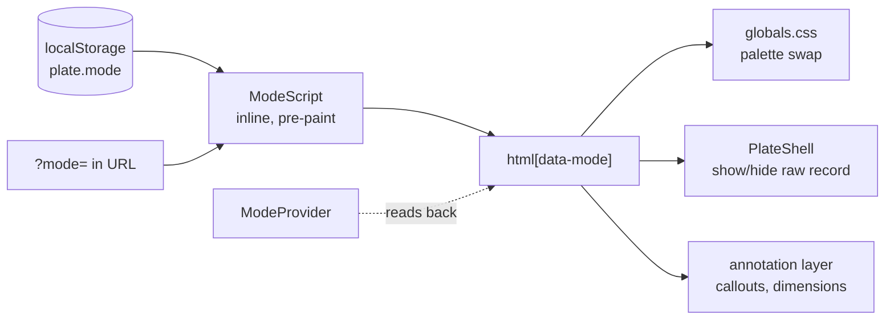
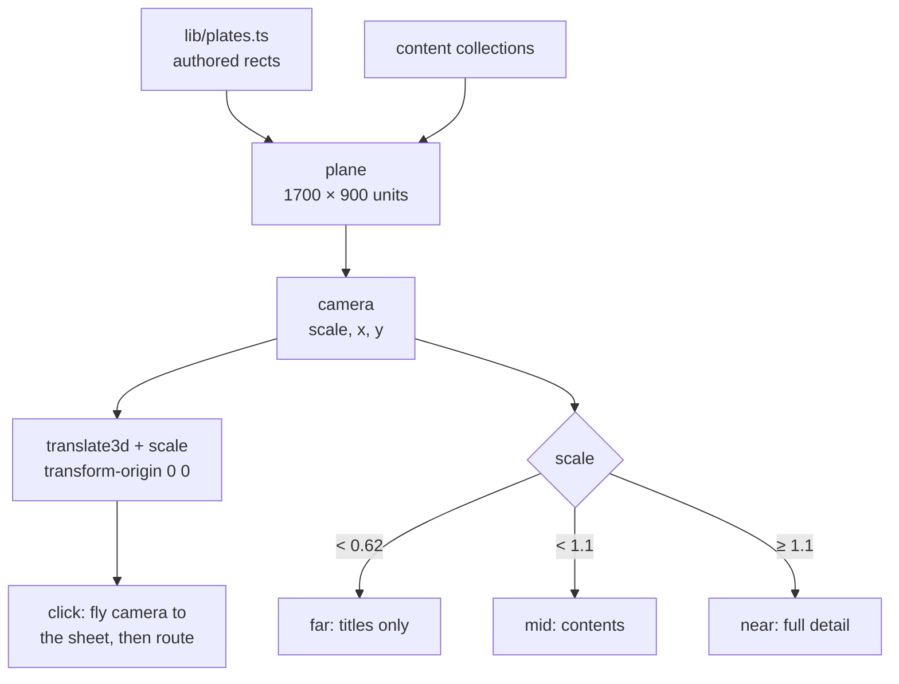
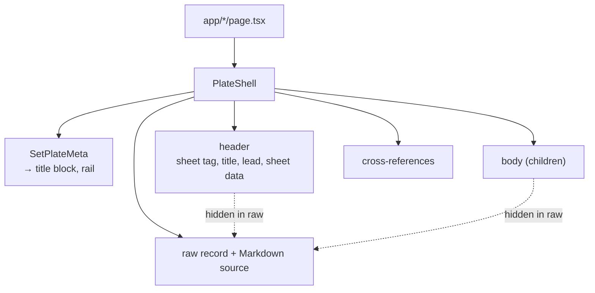
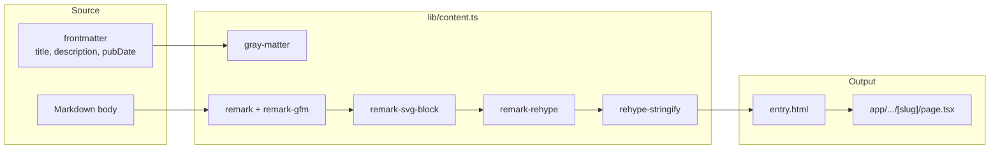
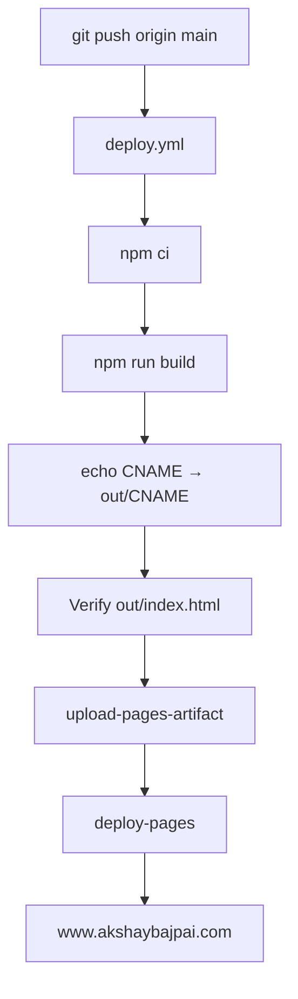

# The Architecture of Intelligence

[](https://github.com/ax5hay/akshaybajpai.com/actions/workflows/deploy.yml)
[](https://www.akshaybajpai.com)
[](https://nextjs.org/)
[](https://www.typescriptlang.org/)
[](https://nodejs.org/)

**Live:** [www.akshaybajpai.com](https://www.akshaybajpai.com)

Personal site built as **an issued drawing set**. Every route is a numbered
sheet, the homepage is the key plan those sheets sit on, and a switch in the
rail re-issues the whole set in three states: the clean artifact, the
engineering markup, and the raw source. Next.js 15 static export, no runtime
services, deployed to GitHub Pages.

---

## Table of contents

- [The idea](#the-idea)
- [Drawing modes](#drawing-modes)
- [Sheet registry](#sheet-registry)
- [Key plan](#key-plan)
- [How a plate is composed](#how-a-plate-is-composed)
- [Interaction model](#interaction-model)
- [Content pipeline](#content-pipeline)
- [Tech stack](#tech-stack)
- [Quick start](#quick-start)
- [Project structure](#project-structure)
- [Authoring content](#authoring-content)
- [Deployment](#deployment)
- [Git workflow](#git-workflow)
- [License](#license)

---

## The idea

The previous version of this site had a Three.js neural map on the homepage
and conventional pages everywhere else, joined by an iframe overlay. It read
as two products stapled together.

This version commits to one metaphor end to end. The site is a drawing set:

- **Every route is a sheet** with a number, a discipline, a scale, and a
  revision — `A-101 The Architect`, `S-201 Structural Principles`, `W-402 AIDA`.
- **The homepage is the key plan** (`G-000`), a general-arrangement drawing
  showing where every sheet sits, with leader lines for cross-references.
- **The chrome never leaves.** The drawing frame, zone rulers, trim marks, top
  rail, and title block persist across navigation, so changing route reads as
  a new sheet laid on the same board rather than a new page.

Nothing about the metaphor is decorative only — the sheet numbers are the
navigation, the cross-references are real links, and the title block always
reports the sheet you are actually on.

---

## Drawing modes

The switch in the rail re-issues the set. This is the "dev-aligned version"
of the site, and it is a first-class state rather than a debug toggle.

| Mode | Rev | What it is |
|------|-----|------------|
| **Artifact** | A | The drawing as issued. Warm stock, dense ink, nothing but the work. |
| **Annotated** | B | Cyanotype. Line work reverses to white, and the markup pen turns on: margin notes, dimensions, and labels for the sheet's own anatomy. |
| **Raw** | C | Presentation stripped. The sheet's record — frontmatter, discipline, refs, word count — and the verbatim Markdown behind it. |

### Why it is CSS-only

Mode lives in a `data-mode` attribute on `<html>`, and every mode is expressed
as a palette and a set of `display` rules. No mode branches in React.


```mermaid
flowchart LR
  SCRIPT["ModeScript<br/>inline, pre-paint"] --> HTML["html[data-mode]"]
  STORE[("localStorage<br/>plate.mode")] --> SCRIPT
  QUERY["?mode= in URL"] --> SCRIPT
  HTML --> CSS["globals.css<br/>palette swap"]
  HTML --> SHOW["PlateShell<br/>show/hide raw record"]
  HTML --> PEN["annotation layer<br/>callouts, dimensions"]
  PROVIDER["ModeProvider"] -.reads back.-> HTML
```

Three consequences worth keeping:

1. **All three modes ship as static markup.** There is no second render and no
   hydration flash, because the server already emitted every mode's content.
2. **`ModeScript` resolves the mode before first paint**, so the sheet never
   renders on paper and then re-inks to blueprint.
3. **Switching repaints but never reflows.** The measure is the same width in
   all three modes; annotations are drawn in the margin the prose was already
   leaving empty.

> **Note**
> `ModeScript` is a server component and inlines the storage key literally.
> That key therefore lives in `lib/mode.ts`, which deliberately carries no
> `'use client'` directive. Importing it from `ModeProvider` instead yields a
> client-reference stub at build time and silently breaks persistence.

A mode can be linked directly: [`/architecture/?mode=annotated`](https://www.akshaybajpai.com/architecture/?mode=annotated).

---

## Sheet registry

`lib/plates.ts` is the single source of truth. Sheet numbers follow drawing
convention: a discipline letter, then a series where `x00` is the general
arrangement for that discipline and `x01…` are its detail sheets.

| Sheet | Discipline | Route | Content |
|-------|-----------|-------|---------|
| `G-000` | General | `/` | Key plan |
| `A-101` | Architectural | `/about/` | The Architect |
| `S-201` | Structural | `/architecture/` | Structural Principles |
| `R-301` | Research | `/research/` | Research |
| `W-400` | Works | `/work/` | Works index |
| `W-401…` | Works | `/work/[slug]/` | Case studies |
| `B-500` | Field Notes | `/blog/` | Blog index |
| `B-501…` | Field Notes | `/blog/[slug]/` | Posts |
| `E-600` | Essays | `/essays/` | Essays index |
| `E-601…` | Essays | `/essays/[slug]/` | Essays |
| `C-700` | Correspondence | `/contact/` | Contact |
| `X-999` | Unissued | 404 | Sheet Not Issued |

Detail sheets are numbered at build time by `lib/sheet-index.ts`, which walks
each collection in publication order. Adding a case study renumbers the W
series automatically — nothing is hand-maintained.

---

## Key plan

The homepage is a pannable, zoomable general arrangement rendered in plain
DOM with a single CSS transform. There is no canvas and no WebGL.


```mermaid
flowchart TD
  REG["lib/plates.ts<br/>authored rects"] --> PLANE["plane<br/>1700 × 900 units"]
  CONTENT["content collections"] --> PLANE
  PLANE --> CAM["camera<br/>scale, x, y"]
  CAM --> XFORM["translate3d + scale<br/>transform-origin 0 0"]
  CAM --> LOD{"scale"}
  LOD -->|"< 0.62"| FAR["far: titles only"]
  LOD -->|"< 1.1"| MID["mid: contents"]
  LOD -->|"≥ 1.1"| NEAR["near: full detail"]
  XFORM --> FLY["click: fly camera to<br/>the sheet, then route"]
```

Design decisions worth knowing before editing it:

- **Plate rectangles are authored, not computed.** The general arrangement is
  a designed composition; a force layout would undo that. Coordinates live in
  `KEY_PLAN_FURNITURE` and each plate's `rect`.
- **Only the camera state re-renders.** Drag bookkeeping lives in a ref, so
  `pointermove` never triggers a render it does not need.
- **Leaders run between plate edges, not centres.** A line drawn centre to
  centre would pass under an opaque sheet and never be seen, so each end is
  pulled back to the boundary and the run lives in the gutters.
- **Narrow screens get a stacked index instead.** Pan and zoom need a pointer
  and room for the plan; below `60rem` the same registry renders as a list.

---

## How a plate is composed

`PlateShell` is the one wrapper every content route uses. It renders the
header, the body, cross-references, and the raw record together, and lets CSS
decide which of them the current mode shows.


```mermaid
flowchart TD
  ROUTE["app/*/page.tsx"] --> SHELL["PlateShell"]
  SHELL --> META["SetPlateMeta<br/>→ title block, rail"]
  SHELL --> HEAD["header<br/>sheet tag, title, lead, sheet data"]
  SHELL --> BODY["body (children)"]
  SHELL --> REFS["cross-references"]
  SHELL --> RAW["raw record + Markdown source"]
  HEAD -.hidden in raw.-> RAW
  BODY -.hidden in raw.-> RAW
```

Detail routes (`work`, `blog`, `essays`) go through `ArticlePlate`, which wraps
`PlateShell` with the back link, stack tags, metric schedule, and adjacent
sheets.

### Component kit

| Component | Purpose |
|-----------|---------|
| `kit/ComparisonSlider` | Two clipped layers in permanent register; the divider is a native range input, so keyboard and screen-reader behaviour come free |
| `kit/Controls` | `Button`, `Switch`, `Stamp` |
| `kit/Callout` | Keyed margin note, numbered by CSS counter, annotated mode only |
| `kit/DimensionLine` | Drafting dimension that measures itself and prints the real rendered width |
| `kit/MetricSchedule` | Outcomes as a numbered, ruled schedule |
| `kit/ControlSchedule` | Live specimen panel; its switches write to `<html>` |
| `sheet/SheetRail` | Top rail: breadcrumb, index, lens, mode switch |
| `sheet/TitleBlock` | Expandable bottom-right title block |
| `sheet/SheetIndex` | Full-set search, fuzzy-ranked |
| `sheet/Loupe` | Draggable inspection lens |
| `system/ToastProvider` | Rubber-stamp toasts |

---

## Interaction model

| Key | Action |
|-----|--------|
| <kbd>/</kbd> | Open the sheet index |
| <kbd>D</kbd> | Cycle drawing mode |
| <kbd>L</kbd> | Toggle the inspection loupe |
| <kbd>Esc</kbd> | Close the index or dismiss the loupe |
| <kbd>←</kbd> <kbd>→</kbd> | Move the comparison divider, or walk the mode switch |

Shortcuts are suppressed while typing in a field. Motion is removed under
`prefers-reduced-motion`, including the key plan's camera fly, and every
reveal falls back to its final state rather than staying invisible.

---

## Content pipeline

Markdown is read at **build time** only — there is no runtime CMS. This part
is unchanged from earlier versions of the site.


```mermaid
flowchart LR
  subgraph Source
    FM["frontmatter<br/>title, description, pubDate"]
    BODY["Markdown body"]
  end

  subgraph lib/content.ts
    GM["gray-matter"]
    RM["remark + remark-gfm"]
    RH["remark-rehype"]
    RS["rehype-stringify"]
    SVG["remark-svg-block"]
  end

  subgraph Output
    HTML["entry.html"]
    ROUTE["app/.../[slug]/page.tsx"]
  end

  FM --> GM
  BODY --> RM --> SVG --> RH --> RS --> HTML
  HTML --> ROUTE
```

The raw Markdown is also passed to `PlateShell` verbatim, which is what raw
mode prints.

### Collections

| Collection | Path | Frontmatter | Notes |
|------------|------|-------------|-------|
| `blog` | `content/blog/` | `title`, `description`, `pubDate`, `draft?` | Included in RSS |
| `essays` | `content/essays/` | same | Long-form writing |
| `work` | `content/work/` | + `client?`, `stack?`, `metrics?` | Case studies |

---

## Tech stack

| Layer | Technology | Role |
|-------|------------|------|
| Framework | [Next.js 15](https://nextjs.org/) | App Router, SSG, static export |
| UI | React 19 | Components, client islands |
| Language | TypeScript 5.7 | Types across app and lib |
| Styling | CSS Modules + custom properties | Modes, line weights, drafting scale |
| Markdown | remark, remark-gfm, gray-matter | Parse and render content |
| Fonts | Instrument Serif, IBM Plex Sans/Mono | via `next/font` |
| CI/CD | GitHub Actions | Build + deploy-pages |
| Hosting | GitHub Pages | Serves `out/` |

There is no animation library, no state library, and no 3D runtime. The
rebuild removed `three`, `gsap`, and `lenis`; shared JS is about **103 kB**
across 37 statically exported pages.

---

## Quick start

```bash
npm ci
npm run dev          # http://localhost:3000
```

| Script | What it does |
|--------|--------------|
| `npm run dev` | Dev server |
| `npm run build` | Static export to `out/` plus `rss.xml` |
| `npm run typecheck` | `tsc --noEmit` |

To preview exactly what ships, serve the export rather than the dev server:

```bash
npm run build
npx serve out
```

> **Warning**
> Stop any server holding `out/` before running `npm run build`. The export
> step clears that directory and will fail if it is locked.

---

## Project structure

```
app/
├── layout.tsx            # sheet chrome: frame, rail, title block, providers
├── template.tsx          # per-navigation enter animation
├── globals.css           # tokens, three mode palettes, annotation layer
├── page.tsx              # G-000 key plan
├── about|research|architecture|contact/
├── work|blog|essays/     # index + [slug] detail sheets
└── not-found.tsx         # X-999

components/
├── keyplan/              # KeyPlan
├── plate/                # PlateShell, ArticlePlate, Chronology, forms
├── kit/                  # sliders, controls, callouts, dimensions, schedules
├── sheet/                # frame, rail, title block, index, loupe, plate meta
└── system/               # mode provider/script/selector, toasts

lib/
├── plates.ts             # sheet registry and key plan geometry
├── sheet-index.ts        # detail sheet numbering, adjacency
├── mode.ts               # mode vocabulary (no 'use client' — see note above)
├── content.ts            # Markdown pipeline
└── metadata.ts, format.ts, constants.ts

content/                  # blog, essays, work Markdown
```

---

## Authoring content

1. Add a `.md` file under `content/blog/`, `content/essays/`, or `content/work/`.
2. Include required frontmatter (`title`, `description`, `pubDate`).
3. Set `draft: true` to exclude from production builds.
4. Run `npm run build` — new slugs are picked up by `generateStaticParams`,
   and the sheet number is assigned automatically.

```yaml
---
title: "Healthcare AI Pipeline"
description: "End-to-end ML pipeline for clinical decision support."
pubDate: 2024-11-01
client: "Confidential"
stack: ["Python", "PyTorch", "Kubernetes"]
metrics: ["97% accuracy", "p99 < 120ms"]
---
```

`metrics` entries are parsed into value and label by `MetricSchedule`, so
write them as `"97% accuracy"` rather than a sentence.

---

## Deployment

Push to `main` triggers the deploy workflow. No manual steps after the initial
GitHub Pages setup.


```mermaid
flowchart TD
  PUSH["git push origin main"] --> WF["deploy.yml"]
  WF --> CI["npm ci"]
  CI --> BUILD["npm run build"]
  BUILD --> CNAME["echo CNAME → out/CNAME"]
  CNAME --> VERIFY["Verify out/index.html"]
  VERIFY --> UPLOAD["upload-pages-artifact"]
  UPLOAD --> DEPLOY["deploy-pages"]
  DEPLOY --> LIVE["www.akshaybajpai.com"]
```

### One-time GitHub setup

1. **Settings → Pages → Build and deployment:** Source = **GitHub Actions**
2. Ensure repo root `CNAME` contains `www.akshaybajpai.com`
3. DNS: CNAME record `www` → `<user>.github.io`

See [DEPLOYMENT.md](./DEPLOYMENT.md) for the full runbook.

---

## Git workflow

| Step | Command |
|------|---------|
| Branch | `git checkout -b feature/your-change` |
| Verify | `npm run typecheck && npm run build` |
| Push | `git push origin feature/your-change` → open PR → merge to `main` |
| Deploy | Automatic on merge to `main` |

`node_modules/`, `.next/`, `out/`, `*.tsbuildinfo`, and `.env*` are ignored.

---

## Configuration reference

`next.config.ts`:

```ts
const nextConfig = {
  output: 'export',
  trailingSlash: true,
  images: { unoptimized: true },
  compress: true,
  poweredByHeader: false,
  reactStrictMode: true,
};
```

---

## License

Content and design © Akshay Bajpai. All rights reserved.
