<div align="center">

<a href="https://www.akshaybajpai.com">
  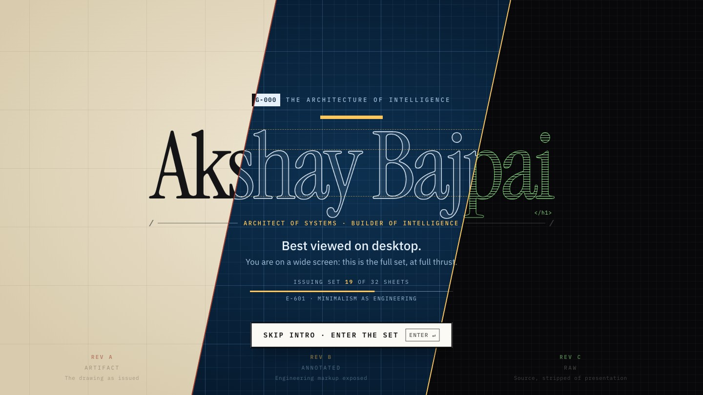
</a>

<br/><br/>

# The Architecture of Intelligence

**A personal site, issued as a drawing set.**

Every route is a numbered sheet. The homepage is the key plan they sit on.<br/>
The whole set re-issues in three states, and a lens shows what any part of it is made of.

<br/>

[](https://www.akshaybajpai.com)

[](https://github.com/ax5hay/akshaybajpai.com/actions/workflows/deploy.yml)


**Open a mode directly ·**
[Artifact](https://www.akshaybajpai.com/?mode=artifact) ·
[Annotated](https://www.akshaybajpai.com/?mode=annotated) ·
[Raw](https://www.akshaybajpai.com/?mode=raw)

</div>

<br/>

```
┌────────────────────────────────────────────────────────────────────────────┐
│  ARCHITECTURE OF INTELLIGENCE                  SHEET   G-000    REV    D   │
│  Drawing set · Akshay Bajpai                   SCALE   1:50     ISSUED     │
│  Next.js 15 · static export · GitHub Pages                      2026.09    │
└────────────────────────────────────────────────────────────────────────────┘
```

> **Best viewed on desktop.** The set is drawn for a wide screen: the pannable plan, the
> lens and the sheet transitions open up there. The phone is not that plan made small; it
> is [a drawing of its own](#a-106--on-a-phone).

## Drawing index

| Sheet | Section | What it covers |
|:------|:--------|:---------------|
| [`G-001`](#g-001--the-idea) | **The idea** | Why a drawing set, and what the metaphor buys |
| [`G-002`](#g-002--a-tour-in-pictures) | **A tour in pictures** | The whole site in nine frames |
| [`G-003`](#g-003--the-cover-sheet) | **The cover sheet** | The preloader that actually preloads |
| [`A-101`](#a-101--the-key-plan) | **The key plan** | Camera, level of detail, the plot, the title strip |
| [`A-102`](#a-102--three-drawing-modes) | **Three drawing modes** | Artifact, annotated, raw, and why they are CSS |
| [`A-103`](#a-103--the-figures) | **The figures** | Hand-drafted SVG, and operable schematics |
| [`A-104`](#a-104--the-instruments) | **The instruments** | Lens, index, zone cursor, issue as PDF |
| [`A-105`](#a-105--moving-between-sheets) | **Moving between sheets** | View transitions, keyboard, reduced motion |
| [`A-106`](#a-106--on-a-phone) | **On a phone** | The title sheet, the pile, the dock |
| [`A-107`](#a-107--margin-notes) | **Margin notes** | How a reader learns the set can be operated |
| [`A-109`](#a-109--the-route-the-tour-the-set) | **The route, the tour, the set** | The site remembers what you read; walks you round; and issues itself as one PDF |
| [`A-108`](#a-108--inside-a-sheet) | **Inside a sheet** | Section profile, citable headings, operable figures on every page |
| [`S-201`](#s-201--how-it-is-built) | **How it is built** | Architecture, sheet registry, component kit |
| [`S-202`](#s-202--content-pipeline) | **Content pipeline** | Markdown in, numbered sheets out |
| [`W-401`](#w-401--run-it-locally) | **Run it locally** | Quick start and scripts |
| [`W-402`](#w-402--project-structure) | **Project structure** | Where everything lives |
| [`C-701`](#c-701--deployment) | **Deployment** | GitHub Pages, for free. Full runbook in [DEPLOYMENT.md](DEPLOYMENT.md) |
| [`C-702`](#c-702--measured) | **Measured** | Weight, frame rate, accessibility |

---

## G-001 · The idea

The previous version of this site had a Three.js neural map on the homepage and conventional
pages everywhere else, joined by an iframe overlay. It read as two products stapled together.
This version commits to **one metaphor, end to end**, and the metaphor is load-bearing.

<table>
<tr>
<td width="33%" valign="top">

### Sheets, not pages

Every route carries a number, a discipline, a scale and a revision: `A-101 The Architect`,
`S-201 Structural Principles`, `W-405 AURIXA`. The numbers *are* the navigation.

</td>
<td width="33%" valign="top">

### A key plan, not a landing page

The homepage is `G-000`, a general arrangement showing where every sheet sits. Click one
and that sheet grows into the page it stands for.

</td>
<td width="33%" valign="top">

### Chrome that never leaves

The drawing frame, zone rulers, rail and title block persist across navigation. A route
change reads as a new sheet laid on the same board.

</td>
</tr>
</table>

It is an instrument, not a brochure. There is **no animation library, no state library and
no 3D runtime** in it: the rebuild removed `three`, `gsap` and `lenis`, and everything you
see move is CSS, SVG and the View Transitions API.

---

## G-002 · A tour in pictures

<table>
<tr>
<td width="50%" valign="top">

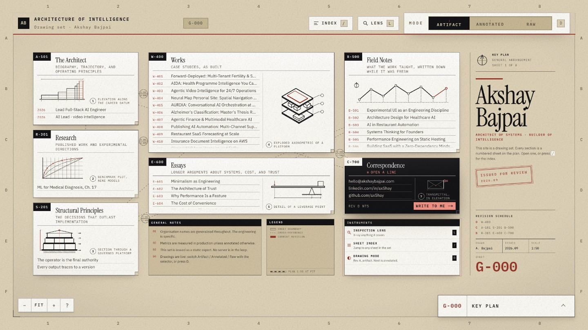

**The key plan.** Seven sheets on a board, each with a drafted figure, joined by
cross-reference leaders. Pan it, zoom it, or walk it with the arrow keys.

</td>
<td width="50%" valign="top">

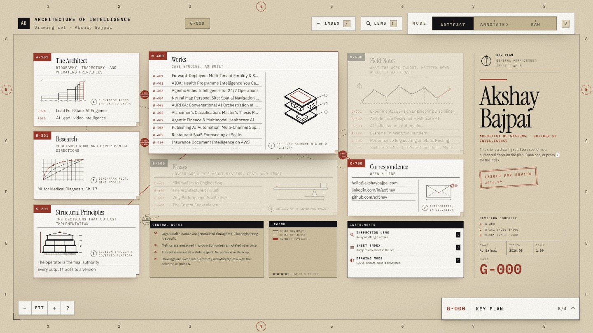

**It reads out its own wiring.** Hover a sheet and the ones it references stay lit while
the rest fall back.

</td>
</tr>
<tr>
<td valign="top">

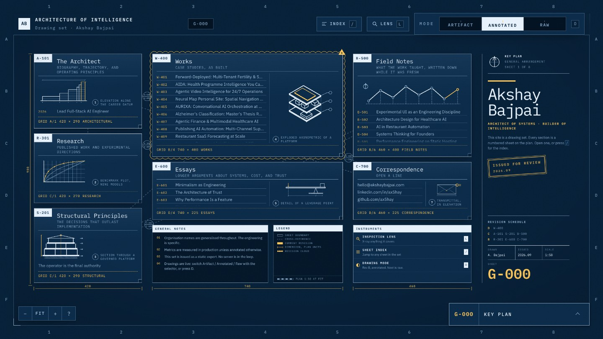

**Annotated.** Cyanotype, with the markup pen on: chain dimensions, a revision cloud, and
a placement note on every sheet.

</td>
<td valign="top">

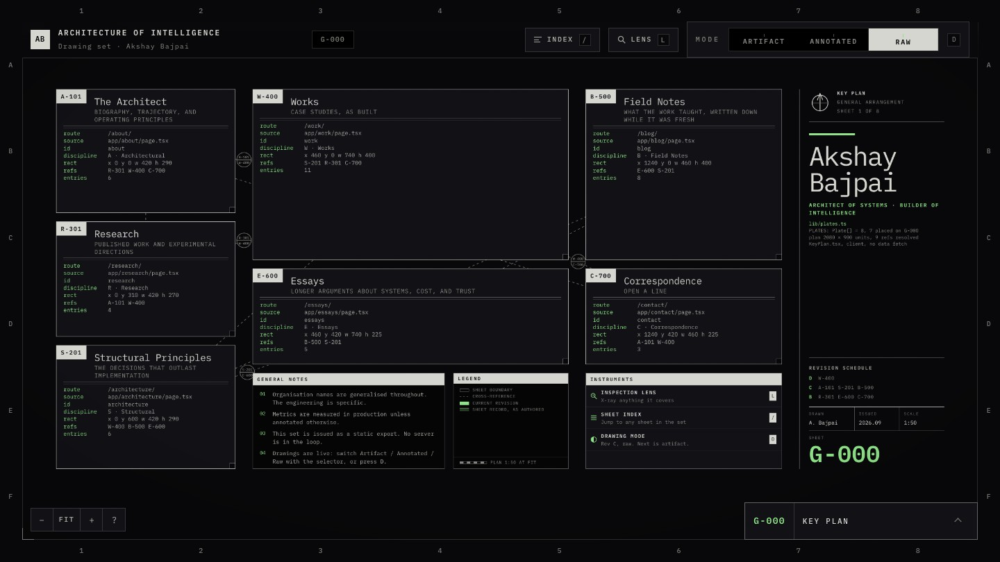

**Raw.** Presentation stripped. Each sheet prints the record it was drawn from.

</td>
</tr>
<tr>
<td valign="top">

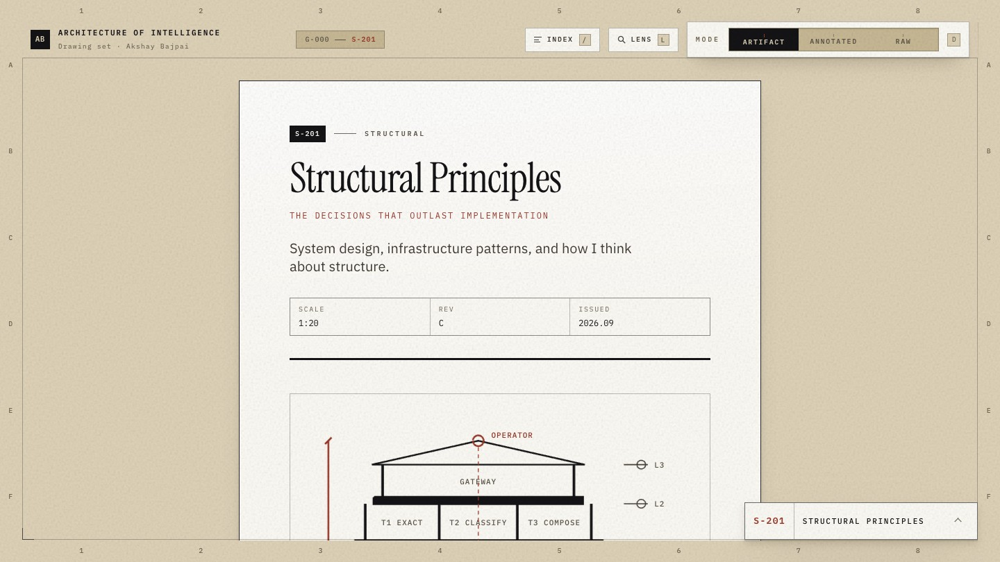

**A sheet.** White stock on the board, with its figure at full size and the same title
block that was on the plan.

</td>
<td valign="top">

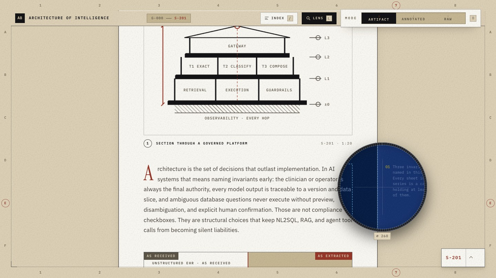

**The lens.** Looks through to the blueprint: the annotation layer appears only where you
hold it, in every mode.

</td>
</tr>
<tr>
<td valign="top">

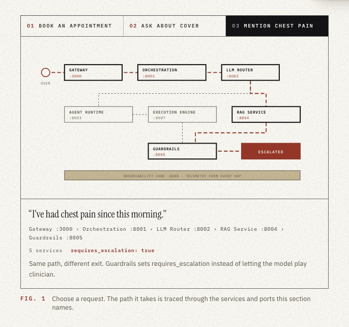

**Operable schematics.** Every case study has one. Choose a scenario and its path is
traced through the pipeline the study describes.

</td>
<td valign="top">

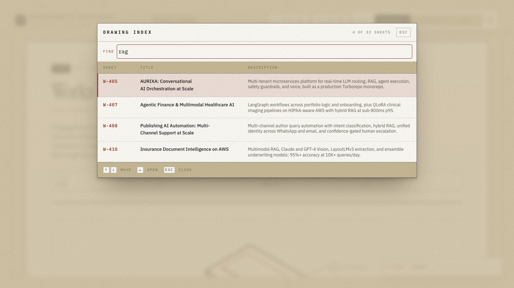

**The sheet index.** Press <kbd>/</kbd>. Every sheet in the set, with the one under the
cursor drawn in small beside the list: its figure, or its section profile.

</td>
</tr>
<tr>
<td valign="top">

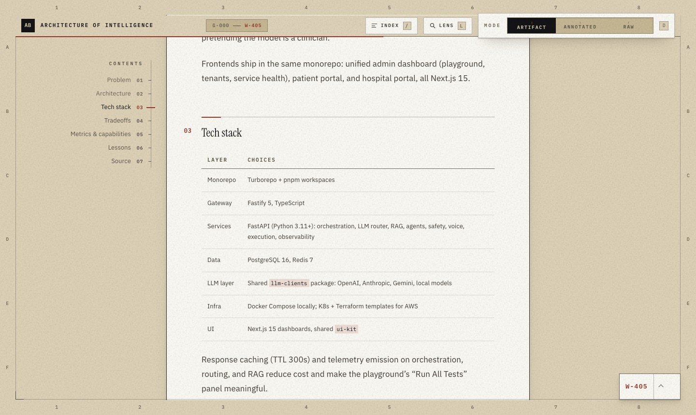

**Inside an article.** Numbered, citable sections, keyed down the margin and followed as
you read.

</td>
<td valign="top">

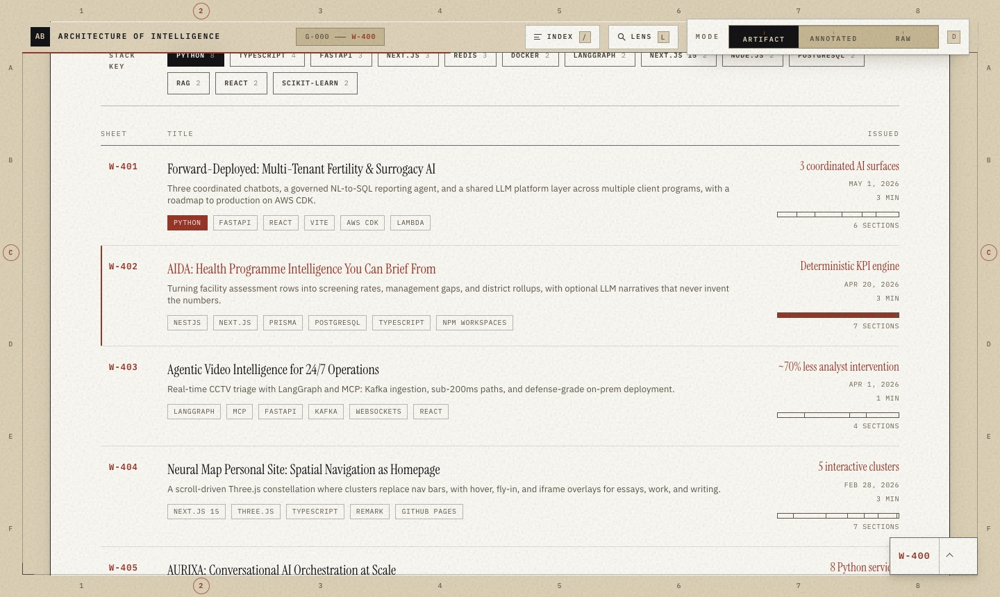

**A schedule that filters.** Choose a tag on Works and the other sheets fall back without
leaving the page.

</td>
</tr>
<tr>
<td valign="top">

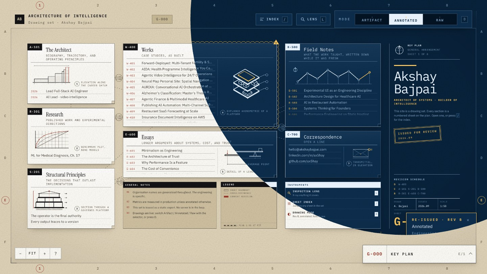

**A mode change develops.** The new state is exposed outward from where you asked for it,
the way a print develops.

</td>
<td valign="top">

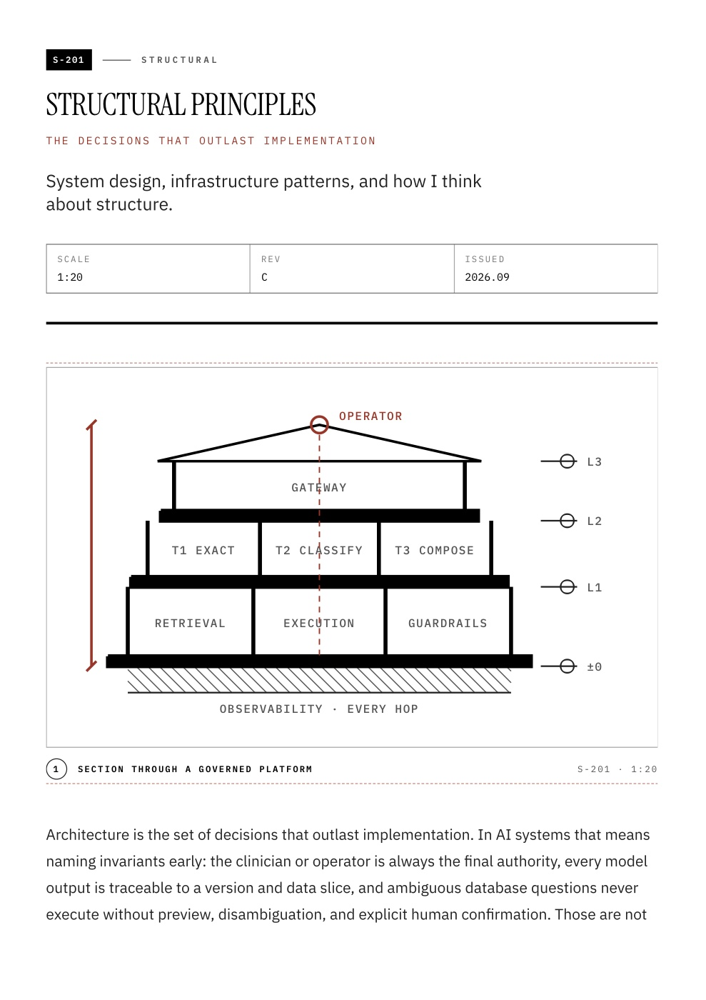

**Issue as PDF.** Any sheet prints as black ink on white stock with its own title strip,
whatever mode is on screen.

</td>
</tr>
</table>

---

## G-003 · The cover sheet

A first load opens on a cover, and the cover does the loading.

<table>
<tr>
<td width="25%" valign="top">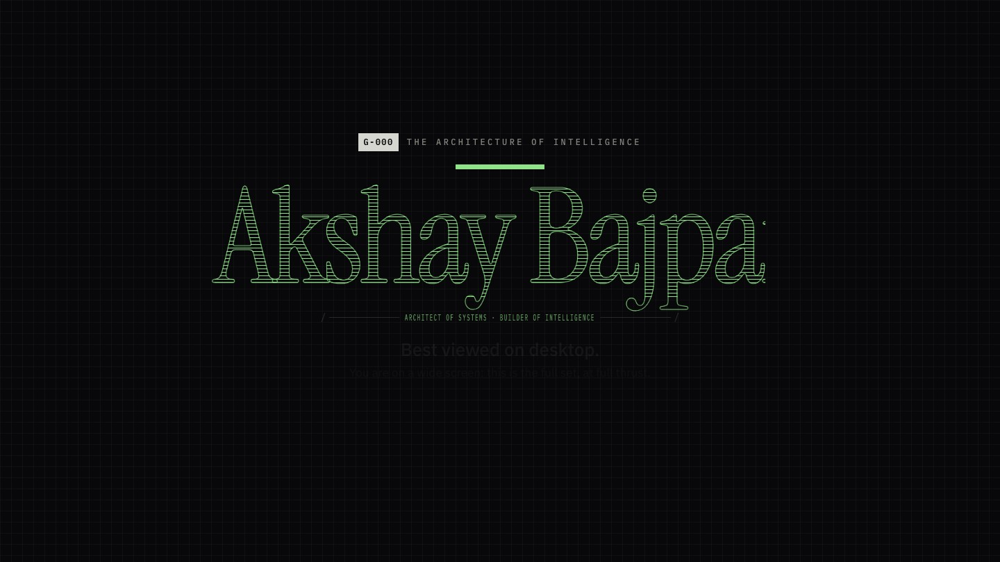<br/><sub><b>1 · Source.</b> The name is plotted as scanlines.</sub></td>
<td width="25%" valign="top">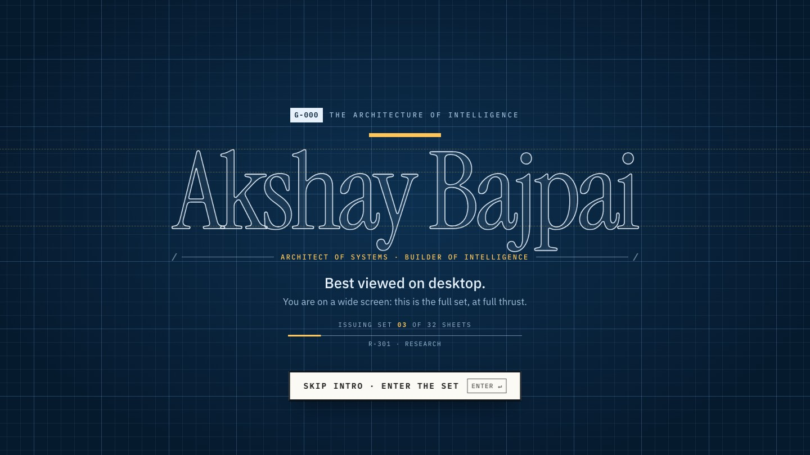<br/><sub><b>2 · Cyanotype.</b> Exposed across the whole sheet.</sub></td>
<td width="25%" valign="top">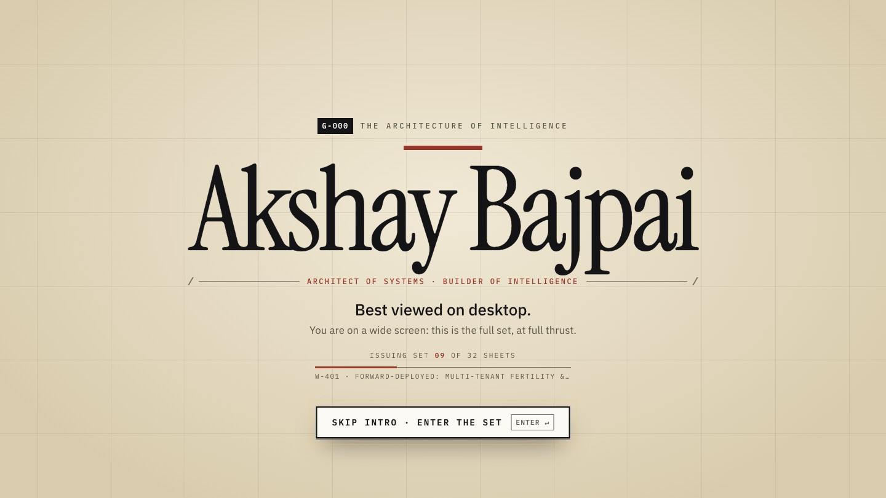<br/><sub><b>3 · Paper.</b> Laid across that, in solid ink.</sub></td>
<td width="25%" valign="top">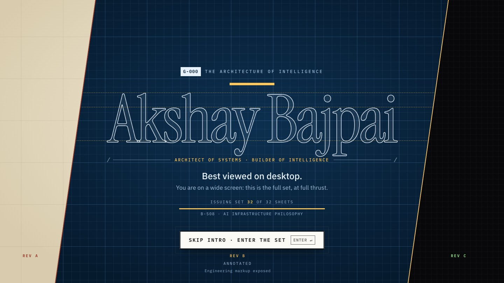<br/><sub><b>4 · Tour.</b> The seams travel; each mode takes the sheet in turn.</sub></td>
</tr>
</table>

**What it shows.** One composition printed three times, once per drawing mode, with the
three prints stacked in exact register: same type, same size, same position, different ink.
Two slanted seams cut between them, so the name reads straight across all three.

**What it does.** While that plays it issues the set: waits for the typefaces, fetches the
lens, and prefetches every other sheet into the router's cache. The counter, the meter and
the line naming the sheet in hand report that work. After the cover, opening any sheet makes
no further page request.

**What it says.** *Best viewed on desktop.* That is half of why the cover exists, so it is
set as a notice and changes with the screen: a confirmation on a wide one, an explanation on
a phone.

**How it ends.** The moment the set has actually loaded, a button offers the way in, and
<kbd>Enter</kbd> does the same. Beside the button a counter runs down to the moment the
cover will lift by itself. **Any other key, or a tap anywhere off the button, holds it
there**: the count stops, the tour carries on, and the reader stays as long as they like.
The same again resumes it. Left alone, the cover is stamped *Issued · Cleared for full
thrust*, and lifts.

| Property | Behaviour |
|:---------|:----------|
| Frequency | Once per visit. `ModeScript` decides before first paint |
| Way in | Offered the moment the set has loaded; <kbd>Enter</kbd> or the button |
| Hold | Any other key, or a tap off the button, stops the count; again to resume |
| Reduced motion | Never shown |
| Slow or metered connection | Only the seven section sheets are prefetched |
| A network that never answers | Loading is given up on after 12 s and the way in is offered anyway |
| No JavaScript | The stylesheet runs the sequence on a fixed clock and removes the cover itself |
| The set behind it | Paused at its first frame (`html[data-cover]`) until the cover reports `data-issued` |

<details>
<summary><b>How the register is kept</b></summary>

<br/>

The seams are two registered custom properties, `--s1` and `--s2`, plus `--slant`. Every
clip path, both hairlines and all three band labels are computed from those values, which is
why the prints cannot drift apart while the seams travel. Per-mode extras (construction
lines on the cyanotype, the `</h1>` tag on source) are absolutely positioned so they never
move the layout the three prints share.

A router prefetch returns no promise, so each sheet's payload is watched for as a
`PerformanceObserver` resource entry. The visible count is paced to the animation: it never
shows a sheet that has not landed, it just does not show them all in one frame.

See [`components/system/Preloader.tsx`](components/system/Preloader.tsx).

</details>

---

## A-101 · The key plan

The homepage is plain DOM under a single CSS transform. No canvas, no WebGL.

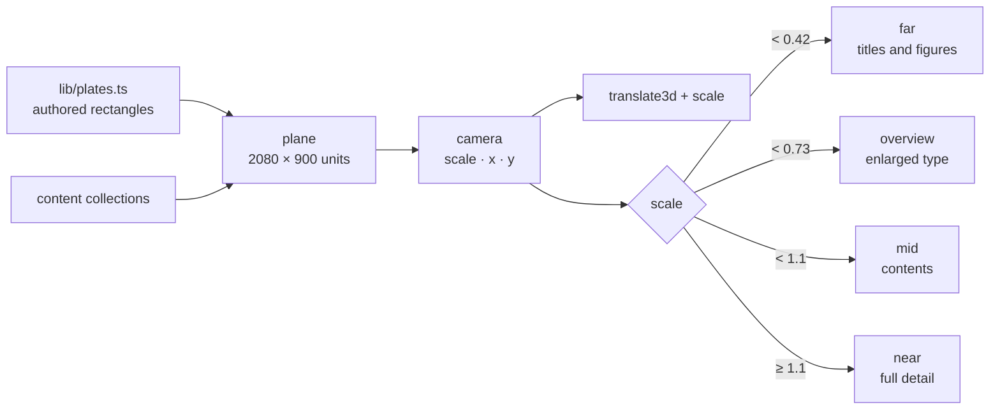
```mermaid
flowchart LR
  REG["lib/plates.ts<br/>authored rectangles"] --> PLANE["plane<br/>2080 × 900 units"]
  CONTENT["content collections"] --> PLANE
  PLANE --> CAM["camera<br/>scale · x · y"]
  CAM --> XFORM["translate3d + scale"]
  CAM --> LOD{"scale"}
  LOD -->|"< 0.42"| FAR["far<br/>titles and figures"]
  LOD -->|"< 0.73"| OVER["overview<br/>enlarged type"]
  LOD -->|"< 1.1"| MID["mid<br/>contents"]
  LOD -->|"≥ 1.1"| NEAR["near<br/>full detail"]
```

| Decision | Why |
|:---------|:----|
| **Rectangles are authored, not computed** | The general arrangement is a designed composition; a force layout would undo it |
| **Type holds its size as the camera pulls out** | The plan is drafted in plan units, so a fitted plan on a laptop would print rows at half size. The plane carries `--inv`, roughly the inverse of the scale, and each sheet shows as many rows as fit |
| **The fit is computed twice, to the same figure** | Once in CSS from container units, so the server-rendered plan is framed before any script runs; once in `KeyPlan.tsx` when the camera goes live. Change `FIT` and `--fit` together |
| **The plan plots itself** | A pen rules each sheet boundary edge by edge, the stock arrives under it, the figures stroke in, and the leaders are plotted last. Switched off after the first sheet transition of a visit |
| **Leaders run between sheet edges** | A centre-to-centre line would pass under an opaque sheet and never be seen |
| **Dimmed sheets stay opaque** | Leaders run underneath, and a see-through sheet would show them crossing its face |
| **Only camera state re-renders** | Drag bookkeeping lives in a ref, so `pointermove` never triggers a render it does not need |
| **The camera is bounded and has inertia** | The plan cannot be panned off the stage, and a pan glides to a stop |
| **A title strip down the right edge** | North point, the name at display size, an issue stamp, the revision schedule and the sheet number, where a drawing carries them |

Below `60rem` the same registry renders as a stacked index: the name, the instrument tray,
then the sheets, each with its figure.

---

## A-102 · Three drawing modes

The switch in the rail re-issues the set. **The modes differ in what they say, not only in
what colour they say it in.**

| | `REV A` · Artifact | `REV B` · Annotated | `REV C` · Raw |
|:--|:--|:--|:--|
| **Reads as** | The drawing as issued | The same drawing with the markup pen on | The drawing stripped to its source |
| **Stock** | Warm paper on a kraft board | Cyanotype | Unlit black |
| **Display face** | Instrument Serif | IBM Plex Mono | IBM Plex Mono |
| **On the key plan** | Figures and contents | Chain dimensions, revision cloud, placement notes | The record each sheet was drawn from |
| **On a sheet** | Prose and figure | Numbered margin notes, self-measuring dimensions | Every part outlined and named, plus the verbatim Markdown |

<table>
<tr>
<td width="50%">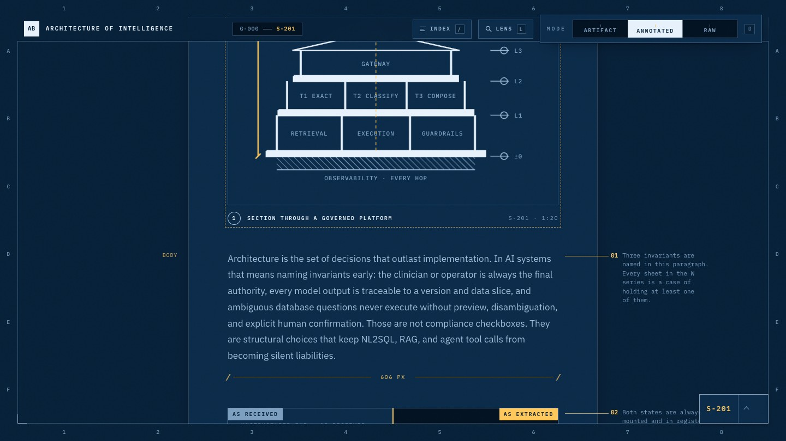</td>
<td width="50%">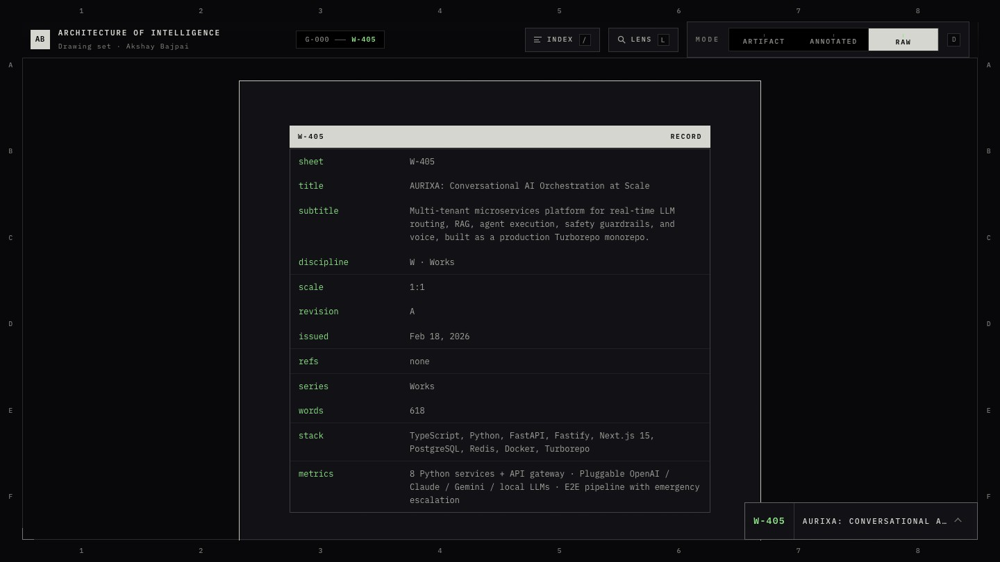</td>
</tr>
</table>

### Why it is CSS-only

Mode lives in a `data-mode` attribute on `<html>`. Every mode is a palette plus a set of
`display` rules. There are no mode branches in React.

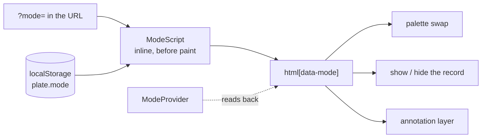
```mermaid
flowchart LR
  QUERY["?mode= in the URL"] --> SCRIPT
  STORE[("localStorage<br/>plate.mode")] --> SCRIPT["ModeScript<br/>inline, before paint"]
  SCRIPT --> HTML["html[data-mode]"]
  HTML --> CSS["palette swap"]
  HTML --> SHOW["show / hide the record"]
  HTML --> PEN["annotation layer"]
  PROVIDER["ModeProvider"] -. reads back .-> HTML
```

1. **All three modes ship as static markup.** No second render and no hydration flash,
   which is why they can differ in substance and still cost nothing to switch between.
2. **The mode resolves before first paint**, so a sheet never renders on paper and then
   re-inks to blueprint.
3. **Switching repaints but never reflows.** Annotations are drawn into margin the prose
   already left empty.

> [!WARNING]
> `ModeScript` is a server component and inlines the storage key **literally**. That key
> lives in `lib/mode.ts`, which deliberately carries no `'use client'` directive. Importing
> it from a client module yields a client-reference stub at build time and silently breaks
> persistence.

---

## A-103 · The figures

A drawing set with nothing drawn in it is a filing system.

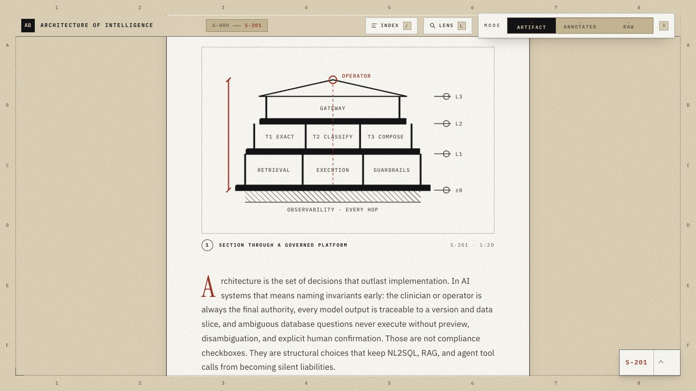

### Drafted figures

Every general-arrangement sheet carries a figure, drawn by hand as SVG in
[`components/figures/PlateFigure.tsx`](components/figures/PlateFigure.tsx). The key plan
shows each one in miniature; the sheet shows it at full size.

| Sheet | Figure |
|:------|:-------|
| `A-101` The Architect | Elevation along the career datum |
| `R-301` Research | Benchmark plot, nine models |
| `S-201` Structural Principles | Section through a governed platform |
| `W-400` Works | Exploded axonometric of a platform |
| `E-600` Essays | Detail of a leverage point |
| `B-500` Field Notes | Survey traverse, one station per note |
| `C-700` Correspondence | A transmittal, in elevation |

They are drawn in four line weights (heavy for what a section cuts, medium for outlines,
thin for detail, hair for hatching) and **they plot themselves**: every stroke carries
`pathLength={1}`, so one CSS rule can run a pen along all of them in the order a
draughtsman would put the lines down.

### Operable schematics

Every case study carries a schematic the reader can operate
([`Schematic.tsx`](components/figures/Schematic.tsx), with the drawings as data in
[`schematics.ts`](components/figures/schematics.ts)). Choose a scenario and its path lights
through the pipeline, with the outcome and a one-line note.

> [!IMPORTANT]
> A schematic only contains what its case study says: the stages, the branches, the
> outcomes, the figures. Where a study gives no number, the schematic gives none.

Where an article already has a diagram typed out as an unlabelled code block, the schematic
is drawn in its place on the sheet. Raw mode still prints the block verbatim.

---

## A-104 · The instruments

A set that can be operated is worth nothing if nobody works out that it can be. So the
tools are **printed on the first sheet you land on**, named, with their keys.

| Instrument | Key | What it does |
|:-----------|:----|:-------------|
| **Inspection lens** | <kbd>L</kbd> | Looks through to the blueprint, and names and measures whatever it covers |
| **Sheet index** | <kbd>/</kbd> or <kbd>⌘K</kbd> | Ranked search across the whole set |
| **Drawing mode** | <kbd>D</kbd> | Cycles artifact, annotated, raw |
| **Key plan camera** | drag · scroll · arrows | Pan with inertia, zoom, walk sheet to sheet |
| **Zone cursor** | move the pointer | The margin rulers ring the zone you are in; the title block reads out the grid reference |
| **Issue as PDF** | title block | Prints the sheet with its own title strip |
| **Comparison slider** | <kbd>←</kbd> <kbd>→</kbd> | A native range input, so keyboard and screen readers work unmodified |

### The sheet index

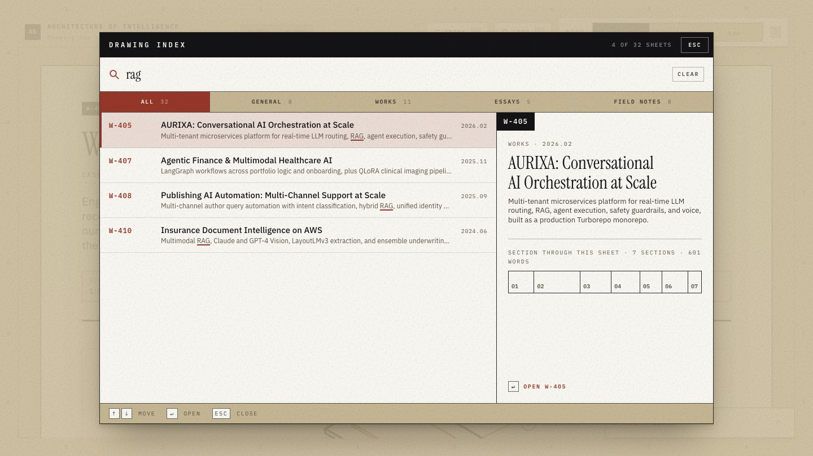

Press <kbd>/</kbd> or <kbd>⌘K</kbd> anywhere.

| | |
|:--|:--|
| **Ranked search** | Sheet number first, then title, then description. Matches are anchored to the start of a word, so `rag` finds RAG and not “leverage”; `fdai` finds *Forward-Deployed AI*. What matched is underlined |
| **Series tabs** | All, General, Works, Essays, Field notes, each with its count |
| **Preview** | On a wide screen the sheet under the cursor is drawn in small: number, title in the display face, and its drafted figure (section sheets) or its section profile with word count (articles) |
| **Keyboard** | <kbd>↑</kbd> <kbd>↓</kbd> move, <kbd>↵</kbd> opens, <kbd>Esc</kbd> closes; focus is held inside the panel |
| **On a phone** | The whole screen, rows a thumb can land on, a 20px field iOS will not zoom into, and no keyboard thrown up until the field is tapped |
| **Cost** | Loaded on demand. It carries the drafted figures, so no page pays for it until the index is opened; the cover sheet fetches it while it plays, and hovering the button does too |

### The lens

Inside the barrel the sheet is a cyanotype, and the annotation layer (dimensions, the
revision cloud, margin notes) is written in wherever the lens passes, in every mode. The
markup is already in the page: `Loupe.tsx` keeps a clip circle on each `[data-lens-layer]`
in that layer's own coordinates, and the pen is loaded with the colour that inverts to amber.

- **Drag** the barrel, or nudge it with the arrow keys.
- **Scroll** over it to change the diameter.
- <kbd>Esc</kbd> or double-click to stow it.

It only names what is actually on the sheet: elements that are faded out or clipped away are
skipped, and where nested boxes would print their names on top of each other, the innermost
wins.

> [!WARNING]
> The barrel shadow must be `box-shadow`, never `filter: drop-shadow()`. Any `filter` on an
> ancestor makes it a **backdrop root**, which leaves the optic with nothing behind it to
> invert and turns the lens into an empty circle.

---

## A-105 · Moving between sheets

Navigation is one continuous move.
[`SheetTransition.tsx`](components/system/SheetTransition.tsx) wraps every in-site route
change in a view transition: whatever is named `sheet` before the change morphs into
whatever is named `sheet` after it.

- A plate on the key plan **grows into** the page it stands for.
- Going home, the page **folds back** onto its plate.
- Between two content sheets, one **reshapes** into the next.
- The rail, frame and title block are named separately, so they hold still.
- The **back and forward buttons** take the same road: the `popstate` is held, a
  transition is opened, and the event is replayed inside it for the router.

| Key | Action |
|:----|:-------|
| <kbd>/</kbd> · <kbd>⌘K</kbd> | Open the sheet index |
| <kbd>D</kbd> | Cycle drawing mode |
| <kbd>L</kbd> | Toggle the lens |
| <kbd>Esc</kbd> | Close the index or stow the lens |
| <kbd>←</kbd> <kbd>→</kbd> <kbd>↑</kbd> <kbd>↓</kbd> | Walk between sheets on the plan, move a comparison divider, nudge the lens |
| <kbd>Enter</kbd> | Leave the cover once the set has loaded |
| any other key | Hold the cover, or resume its count |

Shortcuts are suppressed while typing in a field, and every one is also a button somewhere
on screen.

**Reduced motion.** Under `prefers-reduced-motion` every journey is removed and every state
change kept: no cover, no plot, no transitions, no inertia. **Without view transitions**
(older browsers) sheets change plainly and a mode change is instant.

---

## A-106 · On a phone

<div align="center">
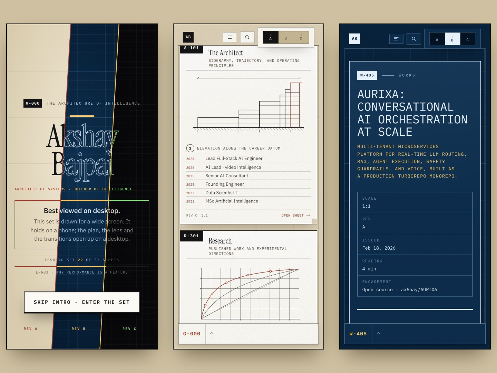
</div>

A phone cannot pan a plan two thousand units wide, so it is not asked to. Below `60rem` the
same registry is drawn as something else.

| Part | What it is |
|:-----|:-----------|
| **Title sheet** | The first screen: north point, the name at the full width of the stock, the issue stamp struck beside it, and the plan itself at thumbnail size |
| **The plan, small** | A miniature of the real arrangement. Tap a sheet and the pile turns to it; the sheet being read stays lit |
| **The pile** | The seven sheets are `position: sticky`, each pinned a little lower than the last, so every sheet slides up and comes to rest on the one before with its edge left showing. No script moves anything |
| **Figures plot on arrival** | Each sheet's figure is drawn as it comes into view, not all seven at once off-screen |
| **The dock** | Below `40rem` the instruments leave the rail for a bar at the foot, where a thumb is: sheet number and title block, index, lens, and the `A · B · C` mode switch |
| **Reading line** | Along the top of the dock a dimension line fills as the sheet is read, driven by a CSS scroll timeline |

Inside the sheets, the phone gets its own handling too:

- **The section strip follows the reader.** With no margin to key sections in,
  the strip sticks under the rail for the length of an article, slimmer once it
  is riding there, with the current section named beneath it.
- **Index profiles ink themselves** as each row passes up the screen, on a CSS
  view timeline, since there is no hover to do it.
- **The stack key is one swipeable line**, not five wrapped rows.
- **Form fields are 16px**, the size below which iOS zooms the page on focus.
- **Wide tables scroll inside themselves**, not the page.
- **Preloading stays out of the way.** The cover starts prefetching only after
  the page's own assets have loaded, and on a narrow screen fetches the seven
  section sheets, not all thirty-one.

Scrolling the pile holds 60 fps (median frame 16.7 ms, worst 21.8 ms, headless Chromium at
390 × 844). Nothing on a phone uses `backdrop-filter`.

> [!WARNING]
> Nothing may overhang the side of the screen, even for one frame of an animation. On a
> phone a single overhanging element widens the whole layout viewport, and everything fixed
> to the screen (the dock, the cover) is then laid out too wide. `.stage` clips with
> `overflow-x: clip`, not `hidden`, so the sticky pile still has the page to stick to.

---

## A-107 · Margin notes

How a reader learns the set can be operated
([`Hints.tsx`](components/system/Hints.tsx)). One note at a time, keyed like a note on a
drawing, saying one thing the reader can do **where they are, on the device they are
holding**.

What a note says depends on the sheet. The things only that sheet can do are
said first, then the things every sheet can:

| Sheet | Said first |
|:------|:-----------|
| Key plan | How to move around it (pan, zoom, arrows; or the pile and the small plan on a phone) |
| An article | The section strip, and that numbered headings copy a reference |
| A case study | That Fig. 1 is operable, then the two above |
| The Architect | That the elevation is operable |
| Works | That the stack key filters |
| Structural Principles | The slider, the schematic and the live switches |

Wording follows the device: *tap* and *swipe* on a phone, *click*, *hover* and
keys on a desktop.

| Rule | |
|:-----|:--|
| Each note is shown | Once, ever |
| A page shows | At most three, one after another |
| The reader can | Dismiss one, or turn them all off for good |
| They wait for | The cover sheet to lift |
| They step aside for | The index, the lens and the open title block |
| Reduced motion | The note stays until dismissed; nothing times out |

<div align="center">
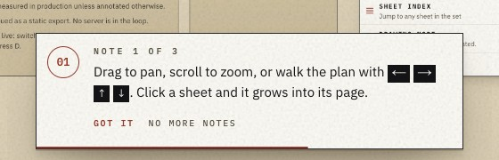
</div>

The dwell is the note's own depletion rule, a CSS animation, and the note leaves on its
`animationend`. So a pointer over the note, or a finger on it, pauses the rule and the
dwell with it, with no timer to keep in step.

---

## A-108 · Inside a sheet

The frame is the same on every route. What is drawn inside it is not.

| On | What the reader gets |
|:---|:---------------------|
| **Every article** | A **section through the sheet**: a strip cut along the article's length, one segment per `##` section, each as wide as its word count. The segment being read is poched, the ones behind are hatched, and a cursor rides the strip at the reader's exact position. A segment jumps to its section |
| | On a wide board the same sections are **keyed down the margin** beside the sheet and stay there as it scrolls |
| | **Numbered, citable headings.** Each `##` is numbered in the sheet's margin; pressing one copies `W-405 / 03 · Tech stack · link` |
| | Measured figures in the schedule of outcomes **count up** to themselves when they come into view |
| | The **next sheet** set large at the foot, with the two after it beneath |
| **`A-101` The Architect** | The career as an **operable elevation**: each role a volume on the datum, selectable by pointer, focus or arrow keys, with the role read out beneath |
| **`R-301` Research** | A ruled **schedule of record** for degrees, the publication and the studies |
| **`S-201` Structural Principles** | A second operable schematic, of the gateway-first routing tiers the page describes |
| **`W-400` Works** | A **stack key** above the schedule. Choosing a tag strikes the other sheets back without removing them, so the schedule keeps its length and numbering. Each row carries its lead figure |
| **Index sheets** (`W-400`, `B-500`, `E-600`) | Every row carries its article's **section profile at thumbnail size**, inked in left to right on hover |
| **Articles that cite each other** | **Cross-references in the text**: the sheets this one links to and the sheets that link here, each named by a split-circle bubble. Read off the Markdown links at build time; a sheet with none shows none |
| **`C-700` Correspondence** | The last stop, and the one sheet printed on **reversed stock**: see below |
| **`X-999` Sheet Not Issued** | Prints the reference that was followed, struck through, and offers the **nearest issued sheets** by shared words in the address |
| **Every sheet** | A reading line along the foot of the rail, driven by a CSS scroll timeline |

<table>
<tr>
<td width="50%" valign="top">
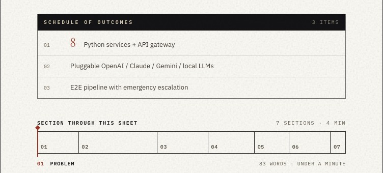
<sub><b>Section through the sheet.</b> One segment per section, as wide as its words.</sub>
</td>
<td width="50%" valign="top">
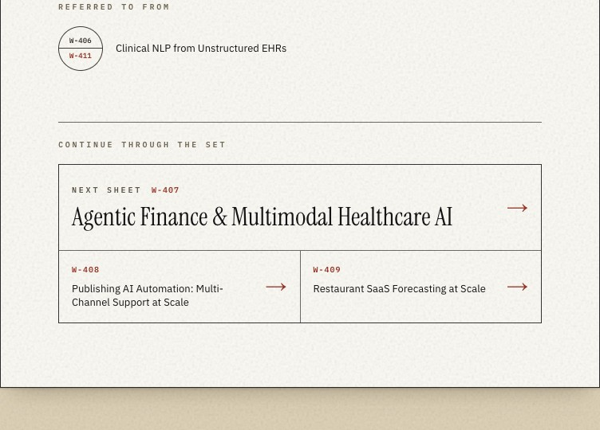
<sub><b>The foot of an article.</b> Cross-references read off its links, then the next sheet.</sub>
</td>
</tr>
<tr>
<td valign="top">
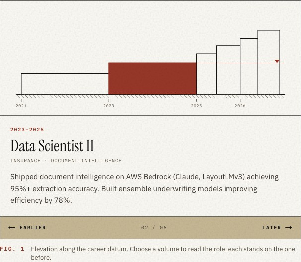
<sub><b>A-101.</b> The career as an operable elevation.</sub>
</td>
<td valign="top">

<sub><b>R-301.</b> A ruled schedule of record.</sub>
</td>
</tr>
<tr>
<td valign="top">
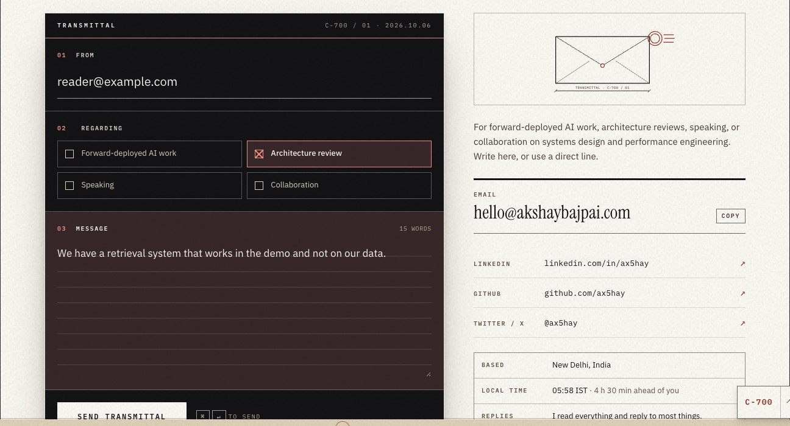
<sub><b>C-700.</b> The form is a transmittal: dated, with tick-box subjects and a word count.</sub>
</td>
<td valign="top">
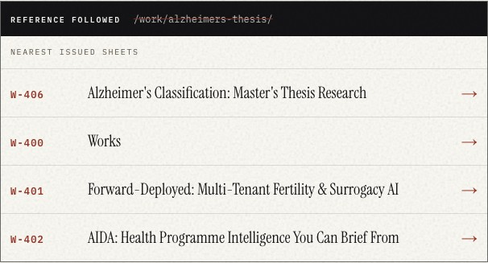
<sub><b>X-999.</b> The reference that failed, struck through, and the nearest sheets.</sub>
</td>
</tr>
</table>

<div align="center">
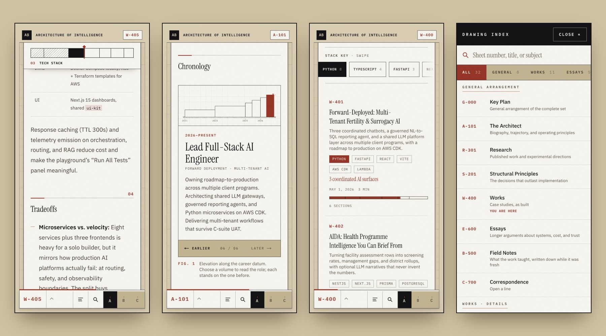
<sub>The same, on a phone: the strip rides under the rail, the stack key swipes, the index takes the screen.</sub>
</div>

<br/>

### Correspondence, on reversed stock

One thing in the set is printed the other way round. On the key plan, `C-700` is
the single solid block among white sheets, with a live "open a line" mark and a
call to write that is never hidden at any zoom. The transmittal it leads to is
printed the same way. In each mode the block takes that mode's own hot colour,
filled: ink on paper, amber on cyanotype, green on source. It is done with one
class, `.reversed`, which redefines the palette tokens on the element so that
everything drawn inside follows.

| The transmittal | |
|:--|:--|
| **Fields** | Numbered and ruled like a printed slip: from, regarding (four tick boxes), message on ruled lines with a live word count |
| **Keeps your draft** | Held for the visit in `sessionStorage`, so reading another sheet and coming back, or a stray reload, loses nothing. Cleared the moment it is sent |
| **Sends from the keyboard** | <kbd>⌘</kbd> <kbd>↵</kbd> or <kbd>Ctrl</kbd> <kbd>↵</kbd> |
| **A receipt** | When it has gone, the form is replaced by a stamped receipt: from, regarding, length |
| **If it fails** | The message stays where it is, and the direct address is offered |

Beside it: the email address at headline size with a copy control, the other
lines, and the **local time in New Delhi** with how far that is from the reader's
own clock.

The section widths, counts and reading times come from the Markdown at build time
(`readSections` in [`lib/content.ts`](lib/content.ts)), so the profile is a true drawing of
the article. Everything here degrades to static content: the server renders the real
figures and all six career roles, and script only adds the motion and the selection.

---

## A-109 · The route, the tour, the set

Three things that belong to the whole set and not to any one sheet.

### Your route

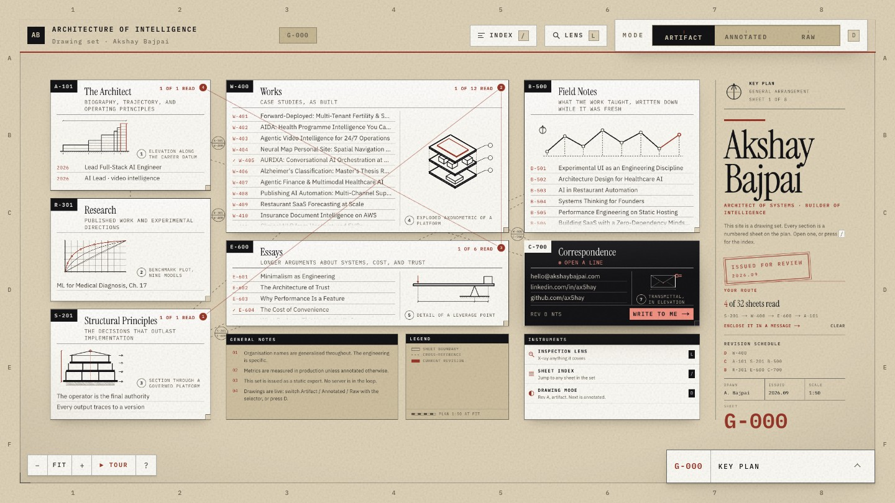

The set remembers what you have read. A sheet counts once you have stayed on it
for three seconds, and from then on:

| Where | What shows |
|:------|:-----------|
| **Key plan** | A survey traverse: a numbered station on each section you have reached, in order, joined by a fine line that plots itself. Each sheet says how much of its section is read, and read rows are ticked |
| **Title strip and title block** | *4 of 32 sheets read*, the stations in order, and a way to clear it |
| **Sheet index** | Read sheets are ticked |
| **Phone** | The same traverse on the small key plan |
| **Correspondence** | The transmittal lists the sheets you read and offers to **enclose** them |

<div align="center">
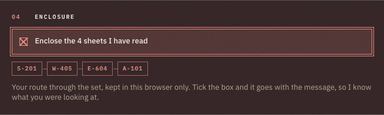
</div>

> [!IMPORTANT]
> The route is kept in the reader's browser (`localStorage`, key `plate.route`) and
> nowhere else. Nothing sends it anywhere. It leaves the machine only if the reader
> ticks the enclosure box on the transmittal, and then only as a line in their own
> message.

### The tour

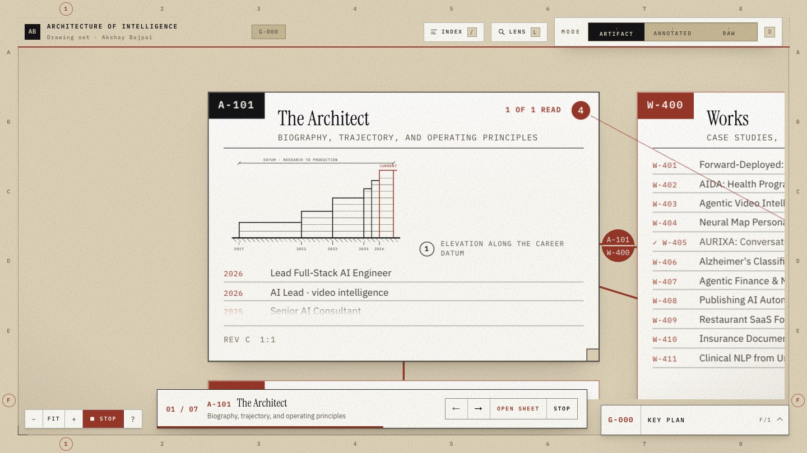

**▶ Tour** on the key plan flies the camera to each sheet in turn and holds on it
for a few seconds, lighting its cross-references while it does. A caption names
the sheet and offers previous, next, *open sheet* and stop; the rule along its
foot is the hold running down. <kbd>←</kbd> <kbd>→</kbd> step, <kbd>Esc</kbd>
stops, and so does touching the plan: it is an offer, not a ride. It is not
offered under reduced motion.

### On a phone: the reel, and the route as a card

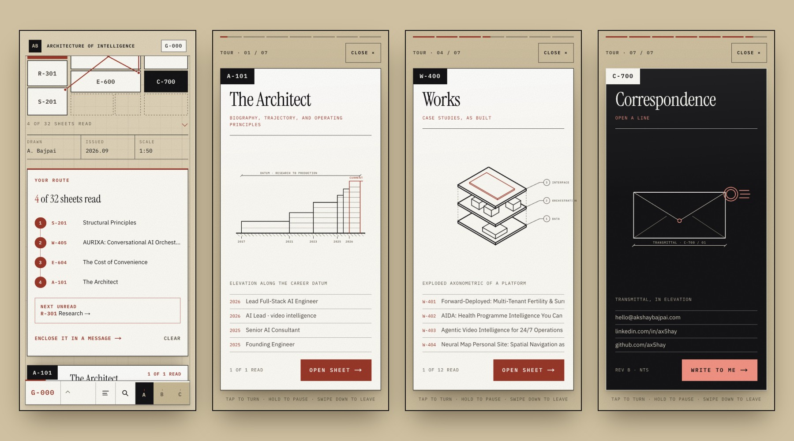

A phone has no plan to fly a camera over, so both are told the way a phone tells
things.

| | |
|:--|:--|
| **The tour is a reel** | One sheet to a screen, its figure plotted as it lands. A row of segments along the top fills as each is held. **Tap right** to go on, **left** to go back, **hold** to pause, **swipe down** to leave. The last sheet is Correspondence, on its reversed stock, and its button says *Write to me* |
| **The route is a card** | On the title sheet, under the small plan: the last five stops by name on a vertical traverse, each a link back; **next unread**, the first sheet in reading order you have not been to; and the way to enclose it |
| **Share** | The title block offers the system share sheet for the sheet you are on, where the browser has one |

The reel's timing is the segment's own CSS animation, and it advances on
`animationend`, so a held finger pauses the fill and the tour together with no
timer to keep in step. It is its own chunk, fetched when the tour is started; a
desktop never downloads it.

### The complete set

<div align="center">
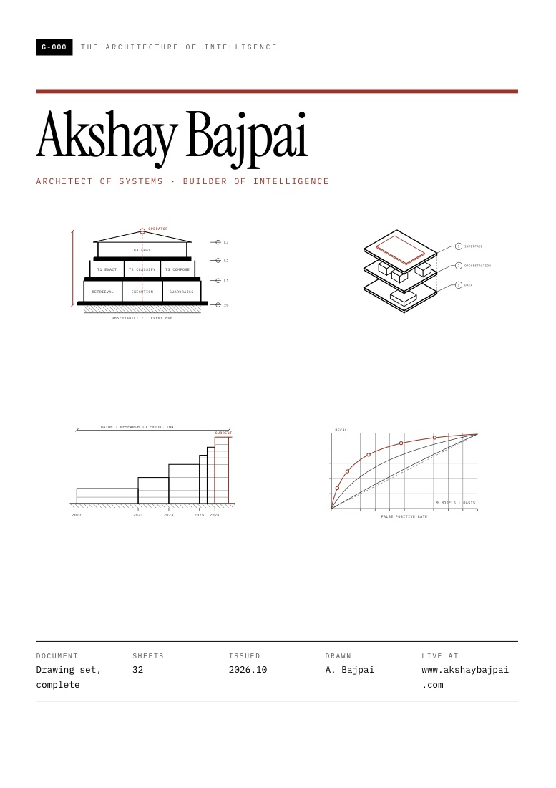
</div>

[`/set/`](https://www.akshaybajpai.com/set/) is every sheet in one document: a
cover, the drawing index, the section sheets, all twenty-four articles with their
schematics, and the contact sheet as addresses. Each sheet starts a new page with
its own title strip. *Issue the whole set as PDF* in any title block goes there;
the browser's print dialog does the rest (88 A4 pages at the time of writing).

It is laid out for paper first, kept out of the index, the sitemap and the cover's
prefetching, and marked `noindex`.

---

## S-201 · How it is built

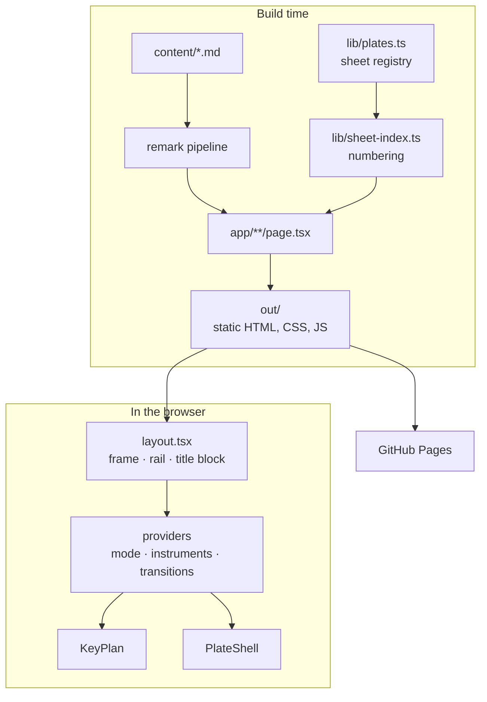
```mermaid
flowchart TD
  subgraph BUILD["Build time"]
    MD["content/*.md"] --> PIPE["remark pipeline"]
    REG["lib/plates.ts<br/>sheet registry"] --> IDX["lib/sheet-index.ts<br/>numbering"]
    PIPE --> ROUTES["app/**/page.tsx"]
    IDX --> ROUTES
    ROUTES --> OUT["out/<br/>static HTML, CSS, JS"]
  end
  subgraph RUN["In the browser"]
    OUT --> LAYOUT["layout.tsx<br/>frame · rail · title block"]
    LAYOUT --> PROV["providers<br/>mode · instruments · transitions"]
    PROV --> PLAN["KeyPlan"]
    PROV --> SHELL["PlateShell"]
  end
  OUT --> PAGES["GitHub Pages"]
```

### Sheet registry

[`lib/plates.ts`](lib/plates.ts) is the single source of truth. Numbers follow drawing
convention: a discipline letter, then a series where `x00` is the general arrangement and
`x01…` are its detail sheets.

| Sheet | Discipline | Route | Content |
|:------|:-----------|:------|:--------|
| `G-000` | General | `/` | Key plan |
| `A-101` | Architectural | `/about/` | The Architect |
| `S-201` | Structural | `/architecture/` | Structural Principles |
| `R-301` | Research | `/research/` | Research |
| `W-400` · `W-401…` | Works | `/work/` · `/work/[slug]/` | Case studies |
| `B-500` · `B-501…` | Field Notes | `/blog/` · `/blog/[slug]/` | Posts |
| `E-600` · `E-601…` | Essays | `/essays/` · `/essays/[slug]/` | Essays |
| `C-700` | Correspondence | `/contact/` | Contact |
| `X-999` | Unissued | 404 | Sheet Not Issued |

Detail sheets are numbered at build time by [`lib/sheet-index.ts`](lib/sheet-index.ts),
which walks each collection in publication order. **Adding a case study renumbers the W
series automatically.**

### How a plate is composed

`PlateShell` is the one wrapper every content route uses. It renders the header, figure,
body, cross-references and raw record together, and lets CSS decide which the current mode
shows.

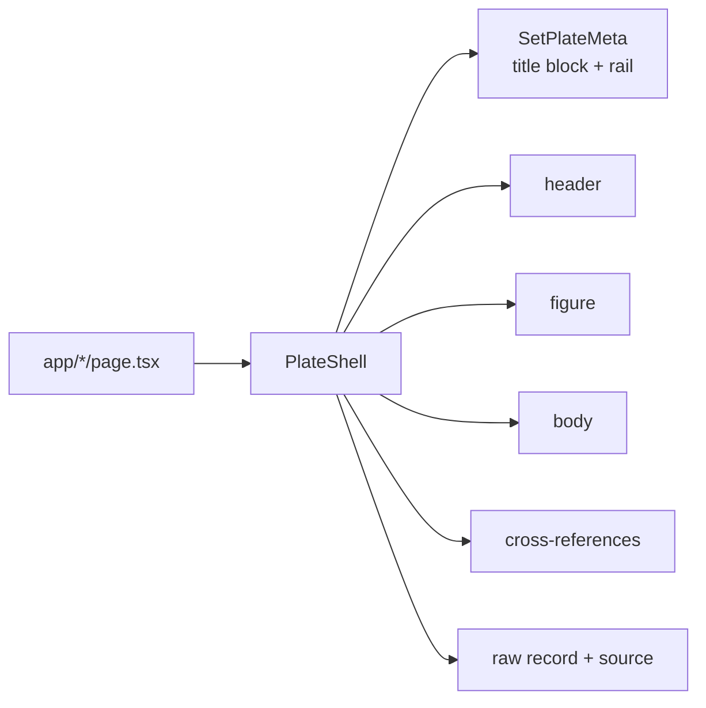
```mermaid
flowchart LR
  ROUTE["app/*/page.tsx"] --> SHELL["PlateShell"]
  SHELL --> META["SetPlateMeta<br/>title block + rail"]
  SHELL --> HEAD["header"]
  SHELL --> FIG["figure"]
  SHELL --> BODY["body"]
  SHELL --> REFS["cross-references"]
  SHELL --> RAW["raw record + source"]
```

<details>
<summary><b>Component kit</b></summary>

<br/>

| Component | Purpose |
|:----------|:--------|
| `keyplan/KeyPlan` | The general arrangement: camera, level of detail, leaders, furniture |
| `figures/PlateFigure` | The drafted figure for each sheet, self-plotting |
| `figures/Schematic` | Operable schematic; drawings are data in `figures/schematics.ts` |
| `plate/PlateShell` | Wrapper for every content sheet |
| `plate/ArticlePlate` | Detail sheet: back link, stack, metrics, schematic, adjacent sheets |
| `plate/SheetSchedule` | Ruled, numbered index table fronting each collection; filterable by stack |
| `plate/SheetProfile` | Section strip and margin key for an article |
| `plate/ProseTools` | Makes an article's numbered headings citable |
| `plate/CareerElevation` | The career as an operable elevation |
| `plate/RecordSchedule` | Ruled schedule of degrees, publications and studies |
| `kit/CountUp` | A measured figure that counts up to itself |
| `kit/CopyValue` | Copy control for a printed value |
| `plate/NearestSheets` | Suggestions on the unissued sheet |
| `sheet/SheetFrame` | Drawing border, zone rulers, trim |
| `sheet/SheetRail` | Top rail: breadcrumb, index, lens, mode switch |
| `sheet/TitleBlock` | Bottom-right title block, grid reference, copy and print |
| `sheet/SheetIndex` | Full-set search with series tabs and a live preview; loaded on demand |
| `sheet/Loupe` | The inspection lens |
| `sheet/ZoneCursor` | Lights the margin zone under the pointer |
| `system/Preloader` | The cover sheet |
| `keyplan/Reel` | The phone's tour: one sheet to a screen |
| `system/Route` | The reader's route: store, tracker and hook |
| `system/Hints` | Margin notes: one thing to do, where you are, once |
| `system/SheetTransition` | View-transition navigation |
| `system/ModeProvider` · `ModeScript` | Mode state, and its pre-paint resolution |
| `system/InstrumentProvider` | Owns the lens and index so any surface can offer them |
| `system/ToastProvider` | Rubber-stamp notices, one per subject |
| `kit/ComparisonSlider` | Two clipped layers in register behind a native range input |
| `kit/Callout` | Keyed margin note, numbered by CSS counter |
| `kit/DimensionLine` | Drafting dimension that measures itself |
| `kit/MetricSchedule` · `ControlSchedule` · `Controls` | Schedules, switches, buttons, stamps |

</details>

### Tech stack

| Layer | Technology |
|:------|:-----------|
| Framework | [Next.js 15](https://nextjs.org/), App Router, static export |
| UI | React 19 |
| Language | TypeScript 5.7 |
| Styling | CSS Modules and custom properties |
| Motion | CSS, SVG, View Transitions API |
| Markdown | remark, remark-gfm, gray-matter |
| Fonts | Instrument Serif, IBM Plex Sans (regular only) and Mono, via `next/font`; self-hosted |
| Contact form | [Formspree](https://formspree.io/) (the only third-party runtime service) |
| Hosting | GitHub Pages, deployed by GitHub Actions |

---

## S-202 · Content pipeline

Markdown is read at **build time** only. There is no runtime CMS and no database.

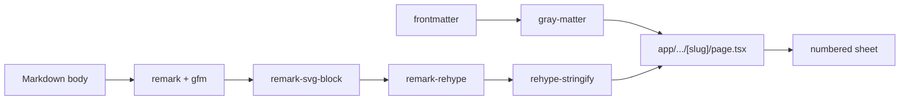
```mermaid
flowchart LR
  FM["frontmatter"] --> GM["gray-matter"]
  BODY["Markdown body"] --> RM["remark + gfm"]
  RM --> SVG["remark-svg-block"] --> RH["remark-rehype"] --> RS["rehype-stringify"]
  GM --> ROUTE["app/.../[slug]/page.tsx"]
  RS --> ROUTE
  ROUTE --> SHEET["numbered sheet"]
```

| Collection | Path | Frontmatter |
|:-----------|:-----|:------------|
| `blog` | `content/blog/` | `title`, `description`, `pubDate`, `draft?` (included in RSS) |
| `essays` | `content/essays/` | same |
| `work` | `content/work/` | plus `client?`, `stack?`, `metrics?` |

<details>
<summary><b>Authoring a new sheet</b></summary>

<br/>

1. Add a `.md` file under `content/blog/`, `content/essays/` or `content/work/`.
2. Include the required frontmatter (`title`, `description`, `pubDate`).
3. Set `draft: true` to keep it out of the build.
4. Push to `main`. The slug is picked up, the sheet number is assigned, and the sheet
   appears on the key plan, in the index, in the sitemap and on the cover's count.

```yaml
---
title: "Healthcare AI Pipeline"
description: "End-to-end ML pipeline for clinical decision support."
pubDate: 2024-11-01
client: "Confidential"
stack: ["Python", "PyTorch", "Kubernetes"]
metrics: ["97% accuracy", "p99 < 120ms"]
---
```

`metrics` entries are split into value and label by `MetricSchedule`, so write them as
`"97% accuracy"` and not as a sentence.

To give a case study an operable schematic, add an entry for its slug to
[`components/figures/schematics.ts`](components/figures/schematics.ts). Only put in it what
the study says.

</details>

---

## W-401 · Run it locally

```bash
npm ci
npm run dev          # http://localhost:3000
```

| Script | What it does |
|:-------|:-------------|
| `npm run dev` | Dev server |
| `npm run build` | Static export to `out/`, then `rss.xml` |
| `npm run typecheck` | `tsc --noEmit` |

To preview exactly what ships, serve the export and not the dev server:

```bash
npm run build
npx serve out
```

> [!TIP]
> The cover plays once per browser tab session. To see it again, open a new tab or a
> private window.

> [!WARNING]
> `npm run build` deletes and recreates `out/`. Stop any server holding that directory
> first, and restart it afterwards.

---

## W-402 · Project structure

```
app/
├── layout.tsx            # sheet chrome, providers, the cover
├── template.tsx          # per-navigation settle animation
├── globals.css           # tokens, three palettes, transitions, print
├── page.tsx              # G-000 key plan
├── about · research · architecture · contact/
├── work · blog · essays/ # index + [slug] detail sheets
├── set/                  # the whole set as one printable document
├── sitemap.ts · robots.ts
└── not-found.tsx         # X-999

components/
├── keyplan/              # KeyPlan
├── figures/              # drafted figures, operable schematics
├── plate/                # PlateShell, ArticlePlate, schedules, forms
├── kit/                  # sliders, controls, callouts, dimensions
├── sheet/                # frame, rail, title block, index, lens, zone cursor
└── system/               # cover, modes, instruments, transitions, toasts

lib/
├── plates.ts             # sheet registry and key plan geometry
├── sheet-index.ts        # detail sheet numbering and adjacency
├── mode.ts               # mode vocabulary; no 'use client', see A-102
├── content.ts            # Markdown pipeline
└── metadata.ts · format.ts · constants.ts

content/                  # blog, essays, work Markdown
scripts/generate-rss.mjs  # post-build RSS
public/                   # favicon, logo, share card, web manifest
docs/media/               # the screenshots on this page
.github/workflows/        # deploy.yml
CNAME                     # www.akshaybajpai.com
```

---

## C-701 · Deployment

The site is hosted on **GitHub Pages, for free**, at
[www.akshaybajpai.com](https://www.akshaybajpai.com). A push to `main` builds and deploys
it in about a minute. Nothing is manual after the one-time setup.

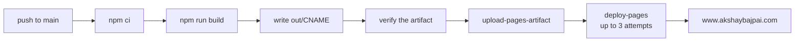
```mermaid
flowchart LR
  PUSH["push to main"] --> CI["npm ci"] --> BUILD["npm run build"]
  BUILD --> CNAME["write out/CNAME"] --> VERIFY["verify the artifact"]
  VERIFY --> UPLOAD["upload-pages-artifact"] --> DEPLOY["deploy-pages<br/>up to 3 attempts"]
  DEPLOY --> LIVE["www.akshaybajpai.com"]
```

**The full runbook is in [DEPLOYMENT.md](DEPLOYMENT.md):** how the pipeline works, DNS and
HTTPS, one-time setup, verifying a deploy, rolling back, and troubleshooting.

---

## C-702 · Measured

Measured on the production build in headless Chromium on an Apple laptop, with the CPU
throttled 4× unless stated. Lighthouse is its mobile preset against a local server with no
compression, so its load figures are pessimistic.

| Metric | Value |
|:-------|:------|
| Sheets in the set | 35 |
| Runtime dependencies | 8, none of them animation, state or 3D |
| Shared JavaScript | 103 kB; no legacy polyfill bundle is shipped |
| First-load JavaScript, key plan | 126 kB |
| First-load JavaScript, a sheet | 109 to 115 kB |
| Downloaded on a cold load, key plan | 718 kB desktop · 229 kB phone (fonts, CSS, JS, HTML) |
| First paint, key plan | 0.54 s desktop · 0.29 s phone |
| Cumulative layout shift | 0 |
| Pan and zoom on the key plan (6×) | 60 fps, median frame 16.6 ms |
| Scrolling the pile on a phone (6×) | 60 fps, median 16.7 ms, no frame over 33 ms |
| Scrolling an article, strip tracking (6×) | 60 fps, median 16.7 ms |
| Dragging the lens (6×) | 60 fps, worst frame 21 ms |
| Opening the index on a phone | 103 ms from tap; 16 ms thereafter |
| Lighthouse accessibility | 100 on the key plan, an article, About, Works, Essays and Contact |
| Lighthouse best practices · SEO | 100 · 100 |
| Lighthouse performance (mobile, uncompressed) | 73 to 81 |
| Prefetched by the cover | 31 sheets on a desktop; the 7 section sheets on a phone or a metered link |
| Requests on navigation after the cover | None for pages; the set is already cached |

### What keeps it fast

Everything that moves is a transform, an opacity or a clip, so the compositor does it.
Beyond that, the decisions that cost the most to get wrong:

| Decision | Why |
|:---------|:----|
| **No polyfill bundle** | Next emits a 112 kB `nomodule` script for browsers that cannot run modern JavaScript. None of them can show this site, so a build step strips it from every page |
| **One sans weight** | Only the regular weight of IBM Plex Sans is ever set; headings and labels take their weight from the serif and the mono. Two unused font files are not downloaded |
| **The drawing index is sent once** | Five client parts need it. Through context it is serialised into the page once, not five times |
| **The lens shifts, then measures** | On scroll the x-ray boxes move with one transform; the page is measured again only once the scroll settles. Measuring on every frame was 396 rectangle reads and a visible stall |
| **A mode change snaps, then develops** | Transitions are held off for the instant the palette changes, on every browser. The wipe (a view transition) carries the motion; a few hundred elements each cross-fading three colours were the slowest part |
| **Nothing animates in a hidden tab**, and the postmark pulse pauses while its sheet is off-screen | |
| **No `body:has()`** | Three rules once used it to hide notes behind the index or the title block. A `:has()` on the body restyles the whole document whenever its subject appears; flags on the root do the same job with one rule |
| **A phone does not carry the wide plan** | The leaders, markup and route layers, legend, tray and camera controls are dropped from the DOM once the width is known: 1,097 nodes to 968. Every restyle on a phone is that much cheaper |
| **A phone prefetches what it cannot hover** | The index, the lens and the tour are fetched when idle, and the index is mounted closed so its first open is already its second |
| **The index renders only what shows** | The preview pane is not rendered where CSS hides it, and on a phone the body's overflow is left alone instead of relaying out the page behind |
| **The cover waits its turn** | Prefetching starts after the page's own assets have loaded, and a narrow screen fetches the seven section sheets, not thirty-one |

Not yet verified: Safari and Firefox. The view transitions degrade to plain navigation
where they are unsupported.

-------|:------|
| Sheets in the set | 32 |
| Runtime dependencies | 8, none of them animation, state or 3D |
| Shared JavaScript | 103 kB; no legacy polyfill bundle is shipped |
| First-load JavaScript, key plan | 122 kB |
| First-load JavaScript, a sheet | 109 to 113 kB |
| Pan and zoom on the key plan | 60 fps (median frame 16.7 ms, worst 19.7 ms) |
| Scrolling the pile on a phone | 60 fps (median frame 16.7 ms, worst 21.8 ms) |
| Cumulative layout shift | 0 |
| Scrolling an article, with the section strip tracking | 60 fps (median frame 16.7 ms, worst 18.7 ms) |
| Lighthouse accessibility | 100 on the key plan, an article, About, Works, Essays and Contact |
| Lighthouse best practices · SEO | 100 · 100 |
| Lighthouse performance (mobile, uncompressed) | 73 to 81 |
| Prefetched by the cover | 31 sheets on a desktop; the 7 section sheets on a phone or a metered link |
| Requests on navigation after the cover | None for pages; the set is already cached |

Not yet verified: Safari and Firefox. The view transitions degrade to plain navigation
where they are unsupported.

---

<div align="center">

**In thrust we trust.**

<sub>Content and design © Akshay Bajpai. All rights reserved.</sub>

</div>
